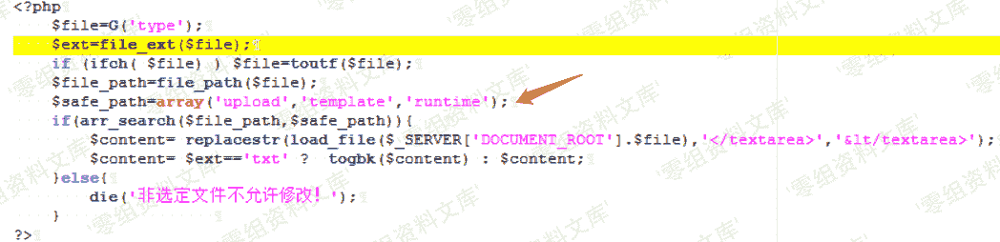
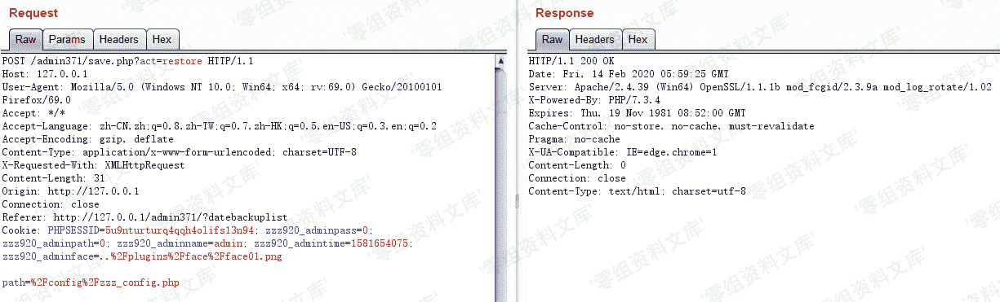

# Zzzcms 1.75 后台任意文件读取

> 原文：[http://book.iwonder.run/0day/Zzzcms/3.html](http://book.iwonder.run/0day/Zzzcms/3.html)

## 一、漏洞简介

*   管理员权限
*   后台管理目录
*   后台数据库为 mysql

## 二、漏洞影响

Zzzcms 1.75

## 三、复现过程

### 任意文件读取（一）

首先来看防护规则，不允许出现./

看 safe_path 只能是 upload template runtime 路径下的

所以构造/runtime/..\config/zzz_config.php 即可绕过防护

### 任意文件读取（二）

首先来看 restore 函数，mysql 数据库，发现 path 是可控的，看 955 行，跟进到 load_file 函数

在 zzz_file.php 文件中，如果存在该 path,则通过 file_get_contents 读取

然后现在的想法是如何输入出来，跟进到 db_exec()函数

在 zzz_db.php 中，看 str_log 把 sql 语句写入到了 log 中

在 zzz.file.php 中，跟进到 str_log 文件，看到文件的命名规则，

文件命名规则为当天时间的时间戳+数据库用户+数据库密码，并且是未授权访问

