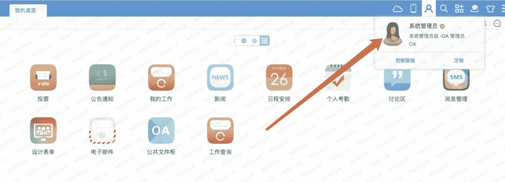

# 通达 oa xss

> 原文：[http://book.iwonder.run/0day/通达 oa/8.html](http://book.iwonder.run/0day/通达 oa/8.html)

## 一、漏洞简介

## 二、漏洞影响

2013、2015 版本

## 三、复现过程

发邮件的地方、问题问答的地⽅都存在 XSS，可获取他人账号权限。⼀般情况下，OA 会有前端进行过滤， 所以抓包时候去添加 payload，之后会对事件进行过滤，所以使用

poc

```
 
```




这个漏洞获取 admin 权限⾮常好用。想 X 谁 X 谁!

