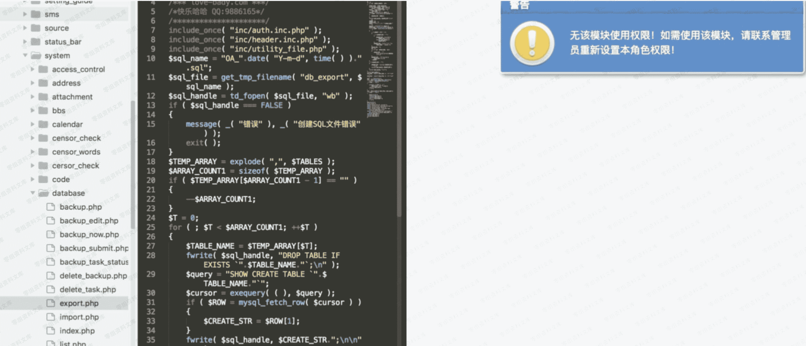

# 通达 oa 越权访问

> 原文：[http://book.iwonder.run/0day/通达 oa/9.html](http://book.iwonder.run/0day/通达 oa/9.html)

## 一、漏洞简介

## 二、漏洞影响

2013、2015 版本

## 三、复现过程

将 get 型访问转换成 post,并且 post 参数 _SERVER,即可越权访问 admin 才能访问的⻚面。根据⽹上的通达 OA 的源码找这些敏感地址,如: /general/system/database/

根据源码,几乎所有敏感的⻚面都可以使用这种方式进行越权访问,⽐如说设置⻆色权限的⻚面啊什么的。这个⻚面就已经可以 XX了!

