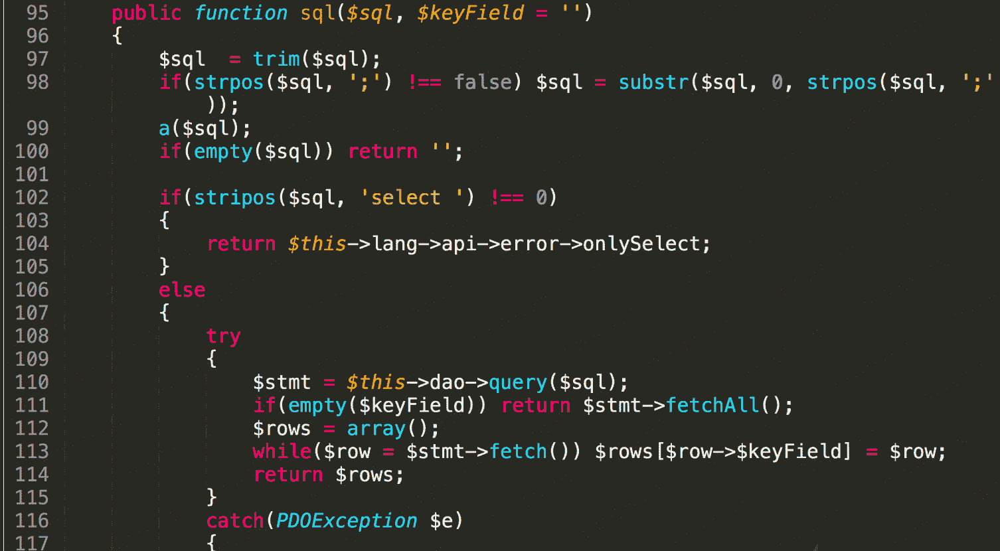

# 禅道 11.6 sql 注入漏洞

> 原文：[http://book.iwonder.run/0day/禅道/2.html](http://book.iwonder.run/0day/禅道/2.html)

## 一、漏洞简介

禅道项目管理软件是一款国产的，基于 LGPL 协议，开源免费的项目管理软件，它集产品管理、项目管理、测试管理于一体，同时还包含了事务管理、组织管理等诸多功能，是中小型企业项目管理的首选，基于自主的 PHP 开发框架──ZenTaoPHP 而成，第三方开发者或企业可非常方便的开发插件或者进行定制。 厂商官网：[https://www.zentao.net/](https://www.zentao.net/) 而此次发现的漏洞正是 ZenTaoPHP 框架中的通用代码所造成的的，因此禅道几乎所有的项目都受此漏洞影响

## 二、漏洞影响

禅道 11.6

禅道开源版 9 版本

## 三、复现过程

禅道的注入在 9 版本当时也出现过，原理是 limit 后的参数采用了直接拼接，但是现在这个版本的禅道对所有的 sql 语句都做了转义处理，并且 get 参数都有严格的限制，不能出现"()"等特殊符号，所以说要想要通过 get 去注入获得数据，会显得非常困难，另外要提到的一点就是禅道很多参数都会有 base64 的解码，这其实也是一个比较不错的突破口，但是这里发现了一个更明显的 sql 注入漏洞。 漏洞代码位于 module/api/model.php 文件的 sql 函数



这里其实是由很多限制的，比如说只能用 select 语句，并且其中可能还不能出现“()”这样的符号，因此这里只能采用最古老的的 select 语句去读数据库信息，虽然简单但是十分有效。 漏洞 url:

```
http://www.0-sec.org/zentaopms_11.6/www/api-getModel-user-getRealNameAndEmails-users=admin

http://www.0-sec.org/zentaopms_11.6/www/api-getModel-api-sql-sql=select+account,password+from+zt_user 
```


这里简单说下禅道目前最新版所采用的 pathinfo 模式，首先通过传参确定进入的 control 文件为 api，对应的 method 为 getModel，接着开始对参数进行赋值，其中 moduleName 为 api，methodName=sql，最后的 param 为 sql=select+account,password+from+zt_user，那么调用了 call_user_func_array 函数后，会进入到 api 目录下的 model 文件，对应调用其中的 sql 函数，并通过赋值，将 sql 变量赋值为 select+account,password+from+zt_user，最后执行 query 语句，造成数据库泄露。

