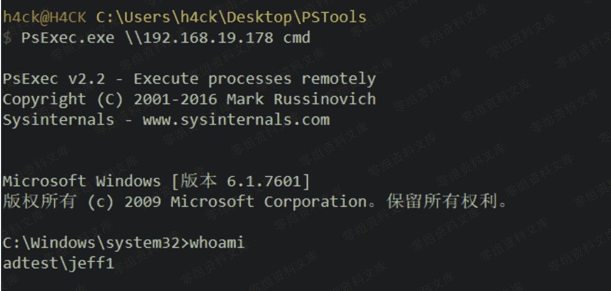

> 原文：[http://book.iwonder.run/域渗透/4.2.1.4.html](http://book.iwonder.run/域渗透/4.2.1.4.html)

#### 4.2.1.4 PsTools

PsTools 是 sysinternals 开发的一个功能强大的安全管理工具包，最新版目前共有 13 个 各种功能的小工具。这里介绍下 psexec，psexec 是一款远程执行命令的工具，在内网渗透 的时候常它来进行横向移动。 下载地址:[https://docs.microsoft.com/zh-cn/sysinternals/downloads/psexec](https://docs.microsoft.com/zh-cn/sysinternals/downloads/psexec)


##### PsExec

###### 1、 若已建立 IPC$连接，无需再次输入账号密码，所有 pstools 工具可直接使用 net use //查看 ipc 连接状态





###### 2、 若未建立 IPC 连接，则要使用账号密码进行登录

```
PsExec.exe \\192.168.19.178 -u adtest\jeff1 -p test@123 cmd.exe 
```


