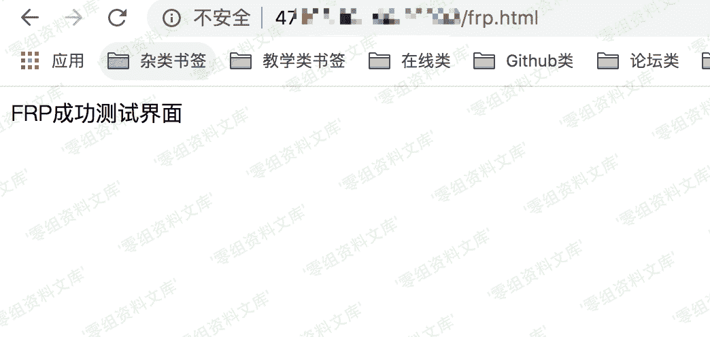

> 原文：[http://book.iwonder.run/内网渗透/内网穿透/frp/1.html](http://book.iwonder.run/内网渗透/内网穿透/frp/1.html)

## frp 内网穿透

### 测试环境：

阿里云公网主机：ip:47.xx.xx.xx 内网主机 windows 域名 （有没有都可以）

### 测试流程

先分别在公网和内网主机上下载 frp 的对应版本 地址为[https://github.com/fatedier/frp/releases](https://github.com/fatedier/frp/releases) linux 直接 wget 或者直接下载好拖进去即可

#### 1.

在 linux 文件目录里修改 frps.ini 配置文件

 第一个端口为链接服务器的端口 第二个端口为访问 web 的端口

#### 2.

修改 windows 文件目录里的 frpc.ini 文件  对应端口对着填就行了

#### 3.

完事之后访问公网 ip+web 端口 如图 

### 排坑指南

1.我是阿里云的服务器，在阿里云控制台 开放了端口之后 依然不通 后来想到我装的有宝塔，然后吧宝塔的防火墙策略也添加了规则就行了

2.custom_domains =这一项 也可以填域名，但是如果填域名的话，测试的时候 比如说你填的带 www 访问的时候就得带 www

