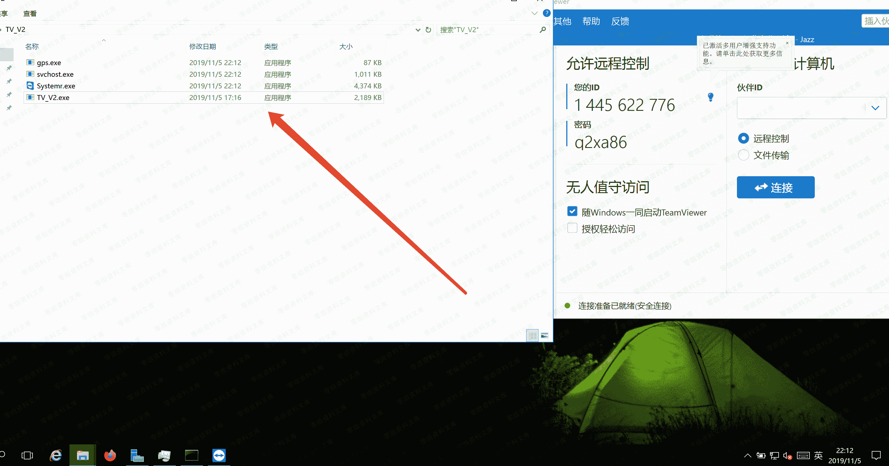
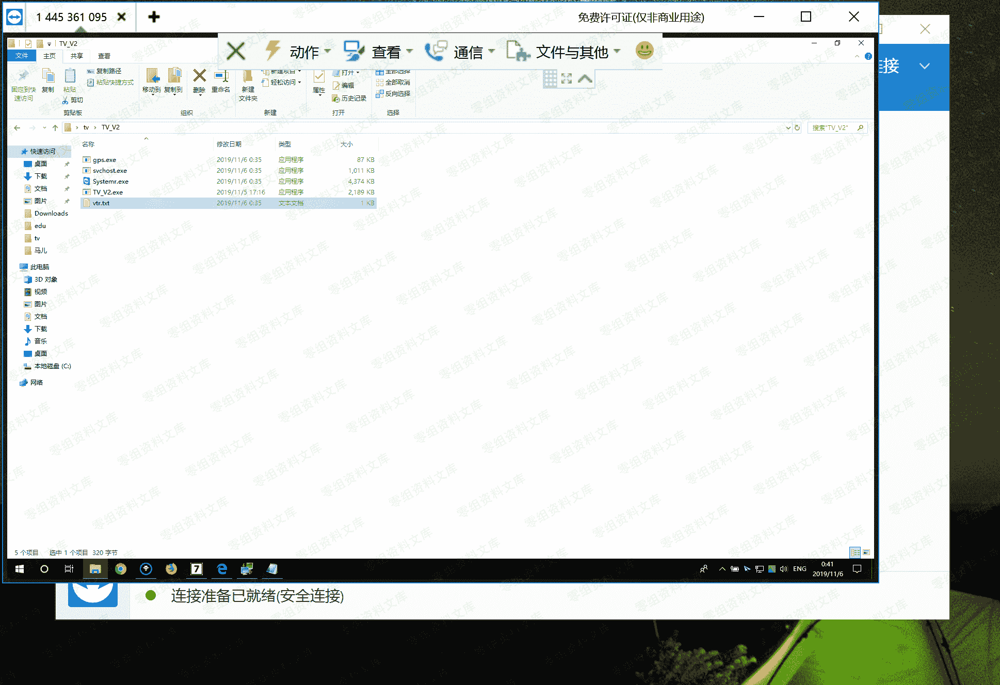

# Teamviewer 内网穿透（一）

> 原文：[http://book.iwonder.run/内网渗透/内网穿透/teamviewer/1.html](http://book.iwonder.run/内网渗透/内网穿透/teamviewer/1.html)

这里利用的原理是强行给对方机子安装上 teamviwer，然后自动把 tv 的远程连接的密码生成到程序目录下的 vtr.txt 里面中，随即用自己本机的 tv 连接就行了

## Github 地址

[https://github.com/ianxtianxt/teamview](https://github.com/ianxtianxt/teamview)

## 复现流程

Github 下载完之后，传入受害机中(我这里是本地虚拟机，就直接演示了)

如图

### 1、运行 TV_V2.exe

会自己在受害机中装一个 tv

会在当前目录下生成如下三个文件

### 2、运行生成的 gps.exe 文件

运行后会生成 vtr.txt，这里面有 ID 和通行证

咱们给他装的 teamviewer 的密码就被读出来啦

连接！

