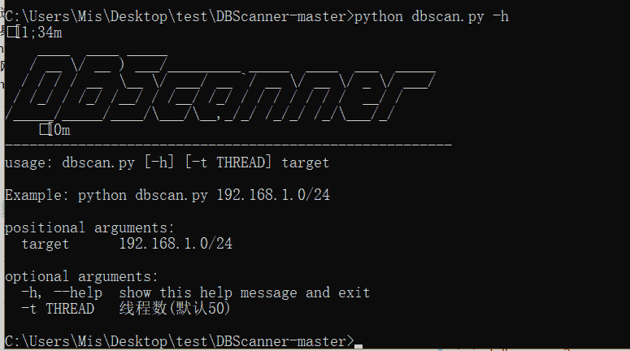

> 原文：[http://book.iwonder.run/内网渗透/内网渗透/DBscanner/1.html](http://book.iwonder.run/内网渗透/内网渗透/DBscanner/1.html)

## 工具说明

自动扫描内网常见 sql、no-sql 数据库脚本(mysql、mssql、oracle、postgresql、redis、mongodb、memcached、elasticsearch)，包含未授权访问及常规弱口令检测

#### 安装过程

```
运行于 python2 的环境下

pip install IPy

pip install gevent

pip install mysql-python

/*如果遇到 WARNING: You are using pip version 19.2.3, however version 19.3 is available

python -m pip install -U pip

下载  https://stackoverflow.com/questions/21440230/install-mysql-python-windows

然后，运行 pip install mysqlclient；如果报错的话请运行 pip install mysqlclient==1.3.4 安装低版本的 mysqlclient

*/

pip install cx_Oracle

pip install pymongo

pip install psycopg2 
```



##### 注：

扫描整个 c 段的时候 ip 地址末尾一定要写 0，否则会报错 python dbscan.py 192.168.50.0/24

##### Github:

[https://github.com/ianxtianxt/DBScanner/](https://github.com/ianxtianxt/DBScanner/)

