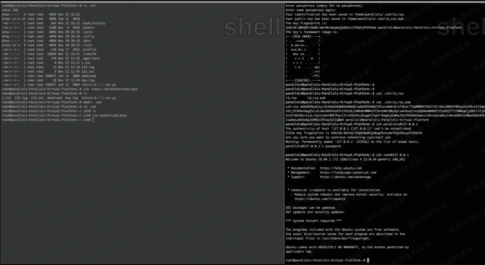

# SSH 公钥免密登陆

> 原文：[http://book.iwonder.run/安全技术/Linux 后门/4.html](http://book.iwonder.run/安全技术/Linux 后门/4.html)

ssh-keygen -t rsa //生成公钥

将 id_rsa.pub 内容放到目标.ssh/authorized_keys 里

这个是老生常谈的公钥免登陆，这种用法不只是用在留后门，还可以在一些特殊情况下获取一个交互的 shell，如 struts 写入公钥，oracle 写入公钥连接等情景。

