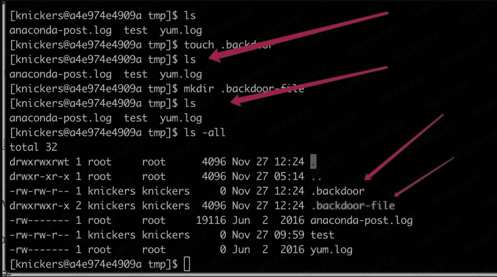

# 建立隐藏文件/文件夹

> 原文：[http://book.iwonder.run/安全技术/Linux 后门/11.html](http://book.iwonder.run/安全技术/Linux 后门/11.html)

```
touch .backdoor
mkdir .backdoor-file 
```



经常使用 linux 中会知道每个目录下其实都有.和..、分别代指的是当前目录和上级目录。 建立...文件也是一个比较好的隐藏方法。

