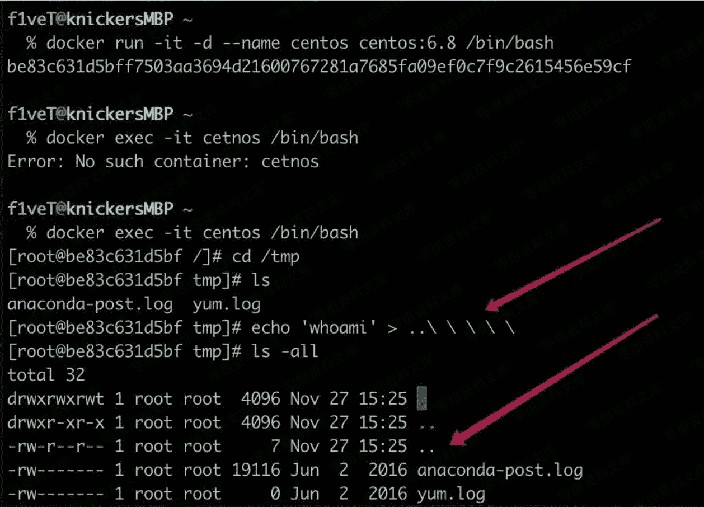
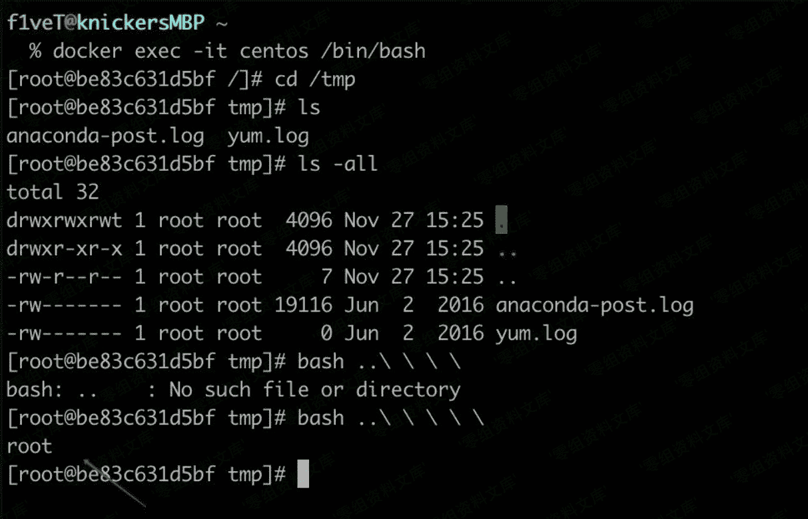

# 建立..文件/文件夹

> 原文：[http://book.iwonder.run/安全技术/Linux 后门/12.html](http://book.iwonder.run/安全技术/Linux 后门/12.html)

```
echo 'whoami'  > ..\ \ \ \ //注意最后一个转义符后有一个空格 
```



```
bash ..\ \ \ \ \ //这里也是多一个空格。 
```



这样建立的文件/文件夹管理员不知道是使用了几个转义符建立的，所以通过 rm+tab 是无法删除的。而且我测试使用 rm -rf ./*也无法删除。

