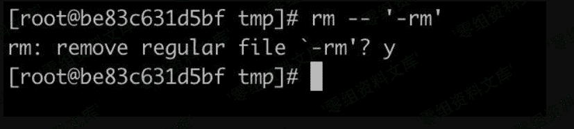

# 参数混淆拦截 rm

> 原文：[http://book.iwonder.run/安全技术/Linux 后门/13.html](http://book.iwonder.run/安全技术/Linux 后门/13.html)

使用 echo 等工具新建一个文件名是-rm 的文件，这样删除的时候 bash 会认为-rmt 是 rm 的参数。


这样就可以阻止管理员去删除， 一般只有 rm -- '-rm'才会删除掉。



但是如果管理员使用正常删除方式会报错。


可以用以下方法。

```
echo 123123123 > -- 
```


这样可以看到，命令执行了，文件没删除，命令也没有报错。类似的可以利用 bash 的\r 缺陷，和管道符、重定向符之类的。

