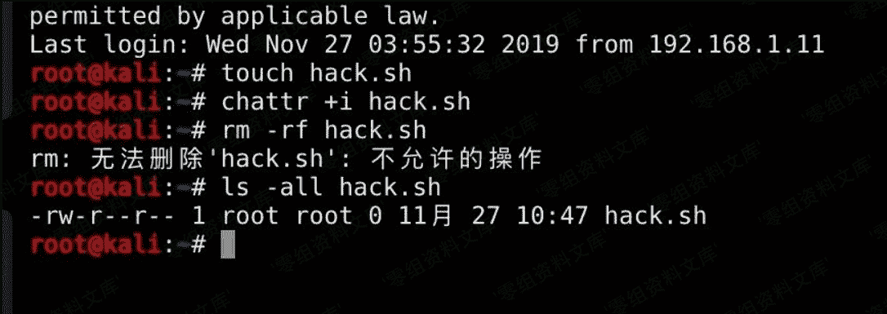

# 创建不能删除的文件（权限隐藏）

> 原文：[http://book.iwonder.run/安全技术/Linux 后门/14.html](http://book.iwonder.run/安全技术/Linux 后门/14.html)

这个用法在 ctf、awd 中应用很多，使用 chattr 来给与隐藏权限。 这些权限需要使用 lsattr 这个命令才可以查看到，而如果要修改隐藏权限，则使用 chattr 这个命令来进行修改。

```
chattr +i hack.sh 
```



无法删除。

