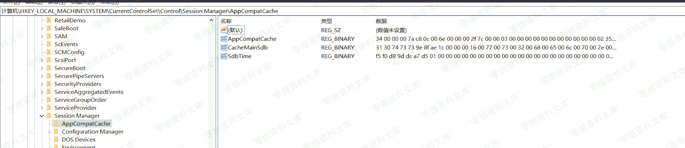
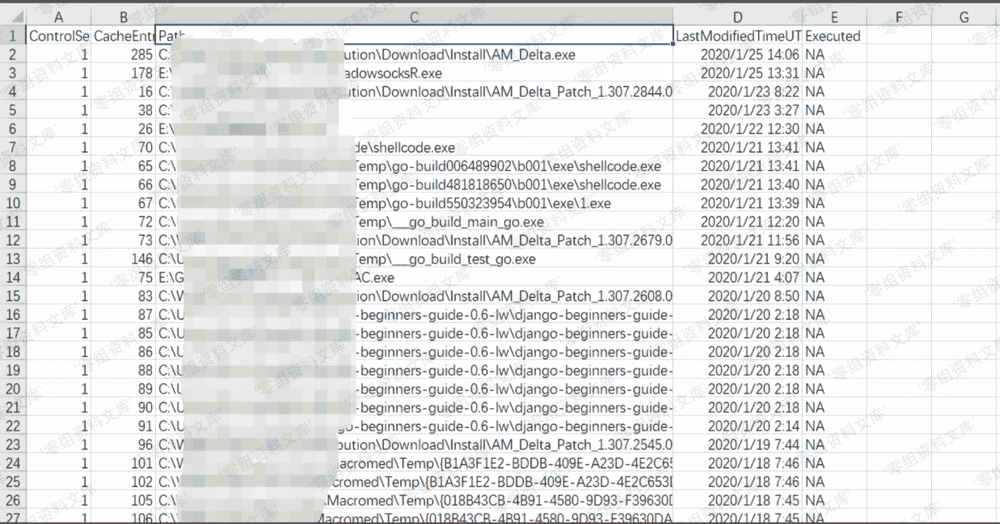
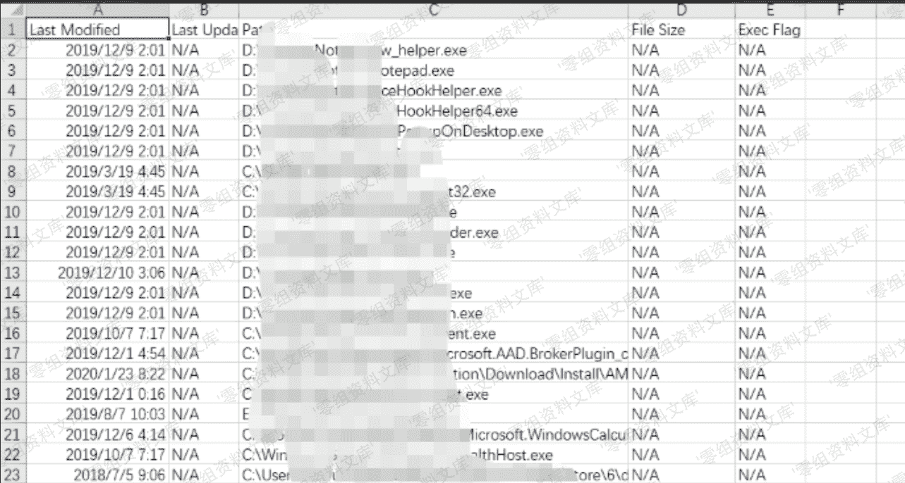

> 原文：[http://book.iwonder.run/安全技术/Windows 取证/4.html](http://book.iwonder.run/安全技术/Windows 取证/4.html)

## ShimCache (AppCompatCache)

> 用来识别应用程序兼容性问题。缓存数据跟踪文件路径、大小、上次修改时间和是否被执行（取决于操作系统），Windows XP 的 ShimCache 被限制为 96 条记录，此后所有版本最多保留 1024 条记录。

**注**：虽然记录在`ShimCache`中的存在但是并不能 100%证明文件是被执行过的，但它确实显示了与文件交互的窗口

注册表位置：

**注**：数据加密，重启之后更新

```
HKEY_LOCAL_MACHINE\SYSTEM\CurrentControlSet\Control\Session Manager\AppCompatCache 
```



解析工具（C#）：

```
https://github.com/ianxtianxt/AppCompatCacheParser 
```

例子 以 csv 格式保存的指定路径

```
AppCompatCacheParser.exe --csv . 
```

按上次修改时间排序

```
AppCompatCacheParser.exe --csv . -t 
```



如果我们想离线分析，我们可以用这个项目：[https://github.com/ianxtianxt/ShimCacheParser](https://github.com/ianxtianxt/ShimCacheParser)

导出注册表

```
reg export "HKLM\SYSTEM\CurrentControlSet\Control\Session Manager\AppCompatCache" ShimCache.reg 
```

解析

```
python ShimCacheParser.py -o test.csv -r ShimCache.reg -t 
```


结果



