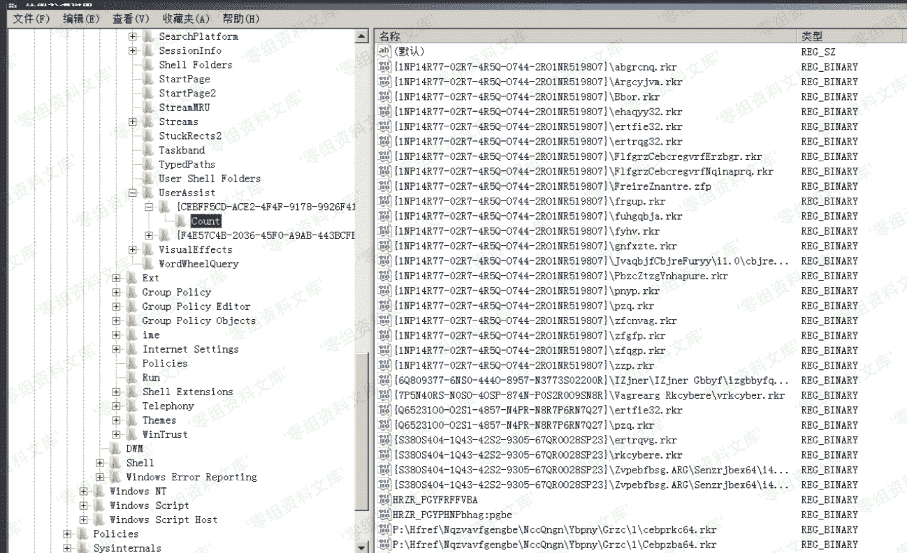
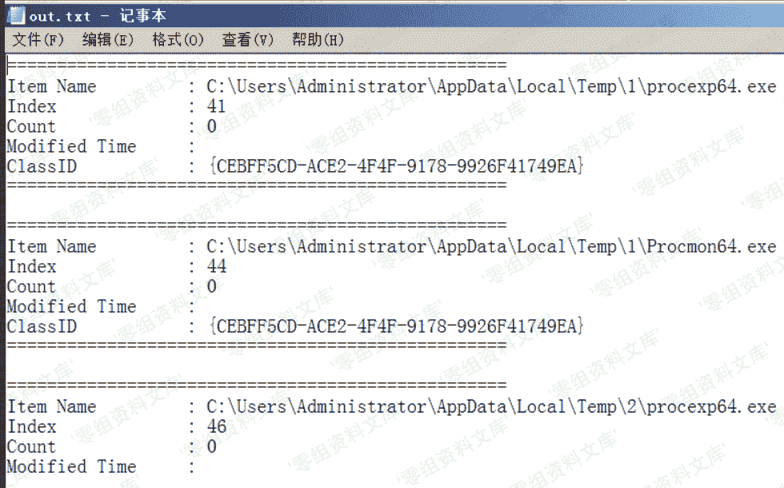

> 原文：[http://book.iwonder.run/安全技术/Windows 取证/5.html](http://book.iwonder.run/安全技术/Windows 取证/5.html)

## UserAssist

> 跟踪在资源管理器中打开的可执行文件和完整路径，其中 UserAssist 保存了 windows 执行的程序的运行次数和上次执行日期和时间。

注册表位置：

**注**：记录实时更新，数据 rot-13 加密

```
当前用户：
HKEY_CURRENT_USER\Software\Microsoft\Windows\CurrentVersion\Explorer\UserAssist

所有用户：
HKEY_USERS\<sid>\Software\Microsoft\Windows\CurrentVersion\Explorer\UserAssist
` 
```



解析工具：[https://www.nirsoft.net/utils/userassist_view.html](https://www.nirsoft.net/utils/userassist_view.html)

图形化界面


命令行使用

```
UserAssistView.exe  /stext out.txt //保存文本格式
UserAssistView.exe  /shtml out.txt //保存 html 格式
UserAssistView.exe  /sxml out.txt  //保存 xml 格式 
```



