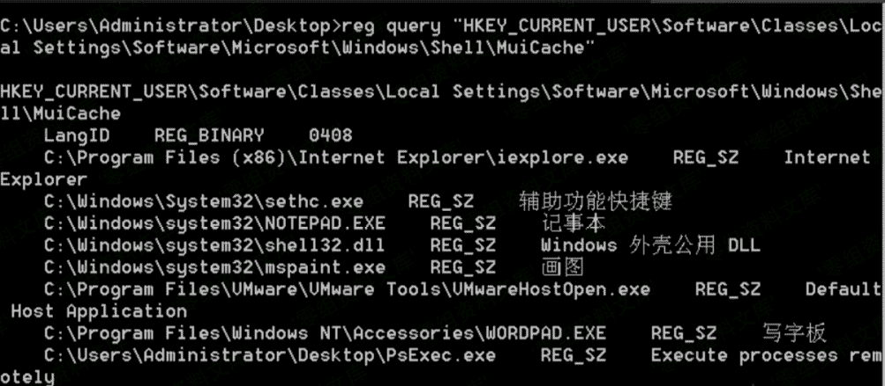

> 原文：[http://book.iwonder.run/安全技术/Windows 取证/6.html](http://book.iwonder.run/安全技术/Windows 取证/6.html)

## MUICache

> 每次开始使用新的应用程序时，Windows 都会自动从 exe 文件的版本资源中提取应用程序名，并将其存储在名为`MuiCache`的注册表项中，供以后使用。

**注**：无加密，记录实时更新

注册表位置： windows server 2003 及以前的

```
当前用户：
HKEY_CURRENT_USER/Software/Microsoft/Windows/ShellNoRoam/MUICache

所有用户：
HKEY_USERS\<sid>\Software\Classes\Local Settings\Software\Microsoft\Windows\Shell\MuiCache 
```

windows server 2003 及以后的

```
当前用户：
HKEY_CURRENT_USER\Software\Classes\Local Settings\Software\Microsoft\Windows\Shell\MuiCache

所有用户：
HKEY_USERS\<sid>\Software\Classes\Local Settings\Software\Microsoft\Windows\Shell\MuiCache 
```


图形化界面：

解析工具：[http://www.nirsoft.net/utils/muicache_view.html](http://www.nirsoft.net/utils/muicache_view.html)


命令行使用

```
MUICache.exe  /stext out.txt //保存文本格式
MUICache.exe  /shtml out.txt //保存 html 格式
MUICache.exe  /sxml out.txt  //保存 xml 格式 
```

或者命令行直接查询注册表也可以

```
reg query "HKEY_CURRENT_USER\Software\Classes\Local Settings\Software\Microsoft\Windows\Shell\MuiCache" 
```



