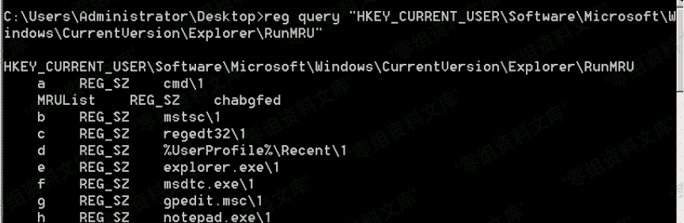

> 原文：[http://book.iwonder.run/安全技术/Windows 取证/7.html](http://book.iwonder.run/安全技术/Windows 取证/7.html)

## RunMRU

> 保存 Win+R 启动程序的历史记录

注册表位置：

**注**：数据无加密，记录实时更新

```
当前用户：
HKEY_CURRENT_USER\Software\Microsoft\Windows\CurrentVersion\Explorer\RunMRU

所有用户：
HKEY_USERS\<sid>\Software\Microsoft\Windows\CurrentVersion\Explorer\RunMRU 
```

命令行查询注册表

```
reg query "HKEY_CURRENT_USER\Software\Microsoft\Windows\CurrentVersion\Explorer\RunMRU" 
```



