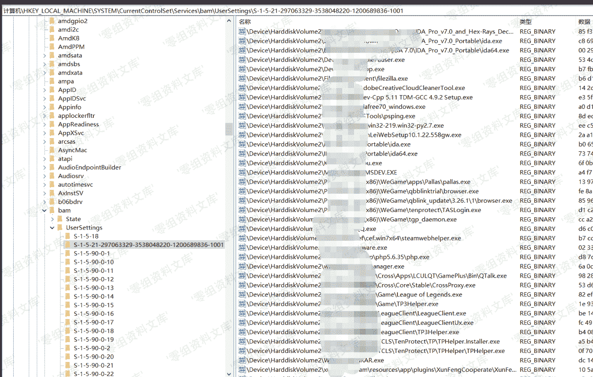
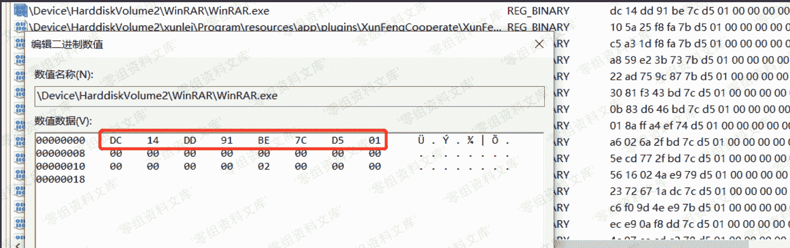

> 原文：[http://book.iwonder.run/安全技术/Windows 取证/9.html](http://book.iwonder.run/安全技术/Windows 取证/9.html)

## Background Activity Moderator (BAM)

> BAM 是一个控制后台应用程序活动的 Windows 服务，该服务存在于 windows10 version 1709 及以后版本中

注册表路径为：

**注**：记录实时更新，数据无加密

```
HKLM\SYSTEM\CurrentControlSet\Services\bam\UserSettings\{SID} 
```

记录包含了程序路径和上次执行日期和时间，其中执行日期键值类型为`FILETIME(64bit little Endian)`



执行时间提取：以`winrar`为例子



把`filetime`转化为`datetime`

```
from __future__ import division
import struct
import sys
from binascii import unhexlify
from datetime import datetime, timedelta

nt_timestamp = struct.unpack("<Q", unhexlify("dc14dd91be7cd501"))[0]
epoch = datetime(1601, 1, 1, 0, 0, 0)
nt_datetime = epoch + timedelta(microseconds=nt_timestamp / 10)

print(nt_datetime.strftime("%Y/%m/%d %H:%M:%S")) 
```

output：`2019/10/07 03:23:21`

