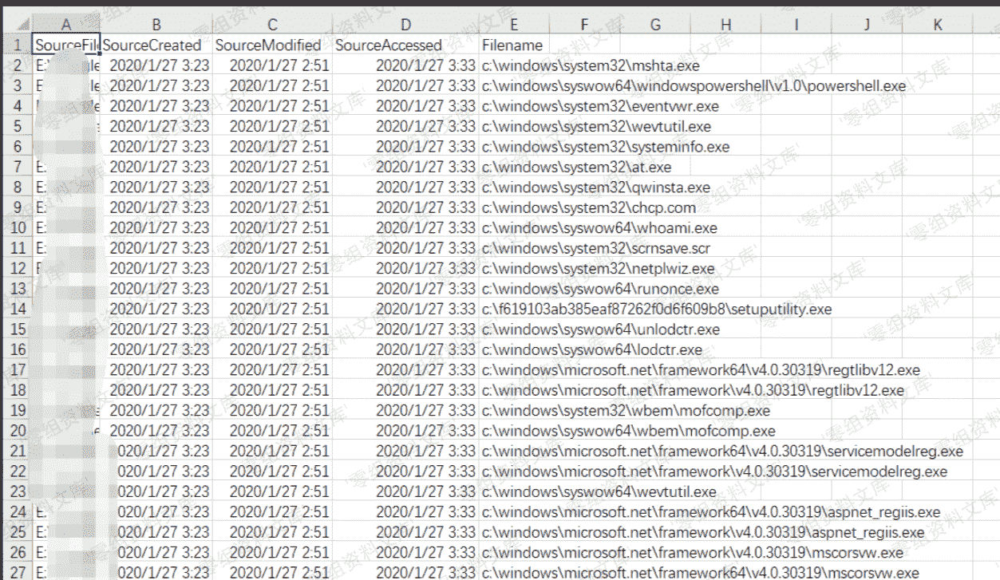
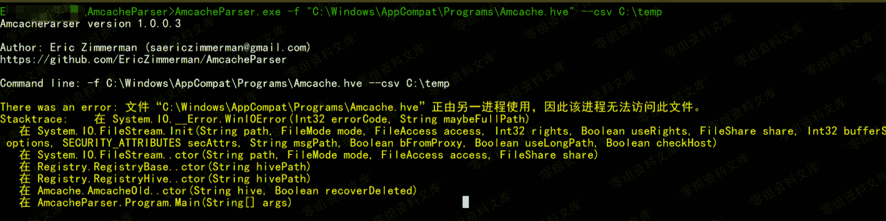
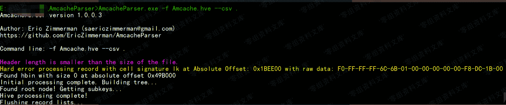
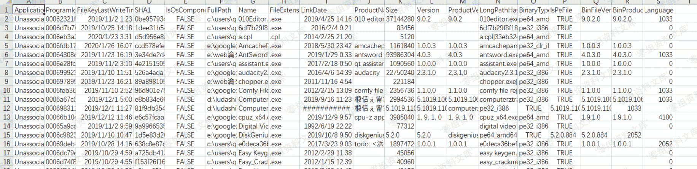

> 原文：[http://book.iwonder.run/安全技术/Windows 取证/13.html](http://book.iwonder.run/安全技术/Windows 取证/13.html)

## Amcache / RecentFileCache.bcf

> Windows 中的使用这两个文件来跟踪具有不同可执行文件的应用程序兼容性问题，它可用于确定可执行文件首次运行的时间和最后修改时间。

`win7`、`windows server 2008R2`等系统保存位置：

> 只包含了程序的创建时间、上次修改时间、上次访问时间和文件名

```
C:\Windows\AppCompat\Programs\RecentFileCache.bcf 
```

`win8`、`win10`、`windows server 2012`等系统保存位置：

> 包含了文件大小、版本、sha1、二进制文件类型等等信息

**注**：Win7 系统安装`KB2952664`后，也会支持 Amcache.hve

```
C:\Windows\AppCompat\Programs\Amcache.hve 
```

`RecentFileCache.bcf`解析工具

`c#`版：[https://github.com/ianxtianxt/RecentFileCacheParser](https://github.com/ianxtianxt/RecentFileCacheParser)

用法实例：

```
RecentFileCacheParser.exe -f "C:\Windows\AppCompat\Programs\RecentFileCache.bcf" --csv "c:\temp"
RecentFileCacheParser.exe -f "C:\Windows\AppCompat\Programs\RecentFileCache.bcf" --json "D:\jsonOutput" --jsonpretty 
```


结果



`python`版：[https://github.com/ianxtianxt/recentfilecache-parser](https://github.com/ianxtianxt/recentfilecache-parser)

用法

```
rfcparse.py -f C:\Windows\AppCompat\Programs\RecentFileCache.bcf 
```

`Amcache.hve`解析工具

`c#`版: [https://github.com/ianxtianxt/AmcacheParser](https://github.com/ianxtianxt/AmcacheParser)

`python`版:

```
#!/usr/bin/python
#    This file is part of python-registry.
#
#   Copyright 2015 Will Ballenthin <william.ballenthin@mandiant.com>
#                    while at Mandiant <http://www.mandiant.com>Exe
#
#   Licensed under the Apache License, Version 2.0 (the "License");
#   you may not use this file except in compliance with the License.
#   You may obtain a copy of the License at
#
#       http://www.apache.org/licenses/LICENSE-2.0
#
#   Unless required by applicable law or agreed to in writing, software
#   distributed under the License is distributed on an "AS IS" BASIS,
#   WITHOUT WARRANTIES OR CONDITIONS OF ANY KIND, either express or implied.
#   See the License for the specific language governing permissions and
#   limitations under the License.
import sys
import logging
import datetime
from collections import namedtuple

import argparse
import unicodecsv
from Registry import Registry
from Registry.RegistryParse import parse_windows_timestamp as _parse_windows_timestamp

g_logger = logging.getLogger("amcache")
Field = namedtuple("Field", ["name", "getter"])

def make_value_getter(value_name):
    """ return a function that fetches the value from the registry key """
    def _value_getter(key):
        try:
            return key.value(value_name).value()
        except Registry.RegistryValueNotFoundException:
            return None
    return _value_getter

def make_windows_timestamp_value_getter(value_name):
    """
    return a function that fetches the value from the registry key
      as a Windows timestamp.
    """
    f = make_value_getter(value_name)
    def _value_getter(key):
        try:
            return parse_windows_timestamp(f(key) or 0)
        except ValueError:
            return datetime.datetime.min
    return _value_getter

def parse_unix_timestamp(qword):
    return datetime.datetime.fromtimestamp(qword)

def parse_windows_timestamp(qword):
    try:
        return _parse_windows_timestamp(qword)
    except ValueError:
        return datetime.datetime.min

def make_unix_timestamp_value_getter(value_name):
    """
    return a function that fetches the value from the registry key
      as a UNIX timestamp.
    """
    f = make_value_getter(value_name)
    def _value_getter(key):
        try:
            return parse_unix_timestamp(f(key) or 0)
        except ValueError:
            return datetime.datetime.min
    return _value_getter

UNIX_TIMESTAMP_ZERO = parse_unix_timestamp(0)
WINDOWS_TIMESTAMP_ZERO = parse_windows_timestamp(0)

# via: http://www.swiftforensics.com/2013/12/amcachehve-in-windows-8-goldmine-for.html
#Product Name    UNICODE string
#==============================================================================
#0   Product Name    UNICODE string
#1   Company Name    UNICODE string
#2   File version number only    UNICODE string
#3   Language code (1033 for en-US)  DWORD
#4   SwitchBackContext   QWORD
#5   File Version    UNICODE string
#6   File Size (in bytes)    DWORD
#7   PE Header field - SizeOfImage   DWORD
#8   Hash of PE Header (unknown algorithm)   UNICODE string
#9   PE Header field - Checksum  DWORD
#a   Unknown QWORD
#b   Unknown QWORD
#c   File Description    UNICODE string
#d   Unknown, maybe Major & Minor OS version DWORD
#f   Linker (Compile time) Timestamp DWORD - Unix time
#10  Unknown DWORD
#11  Last Modified Timestamp FILETIME
#12  Created Timestamp   FILETIME
#15  Full path to file   UNICODE string
#16  Unknown DWORD
#17  Last Modified Timestamp 2   FILETIME
#100 Program ID  UNICODE string
#101 SHA1 hash of file

# note: order here implicitly orders CSV column ordering cause I'm lazy
FIELDS = [
    Field("path", make_value_getter("15")),
    Field("sha1", make_value_getter("101")),
    Field("size", make_value_getter("6")),
    Field("file_description", make_value_getter("c")),
    Field("source_key_timestamp", lambda key: key.timestamp()),
    Field("created_timestamp", make_windows_timestamp_value_getter("12")),
    Field("modified_timestamp", make_windows_timestamp_value_getter("11")),
    Field("modified_timestamp2", make_windows_timestamp_value_getter("17")),
    Field("linker_timestamp", make_unix_timestamp_value_getter("f")),
    Field("product", make_value_getter("0")),
    Field("company", make_value_getter("1")),
    Field("pe_sizeofimage", make_value_getter("7")),
    Field("version_number", make_value_getter("2")),
    Field("version", make_value_getter("5")),
    Field("language", make_value_getter("3")),
    Field("header_hash", make_value_getter("8")),
    Field("pe_checksum", make_value_getter("9")),
    Field("id", make_value_getter("100")),
    Field("switchbackcontext", make_value_getter("4")),
]

ExecutionEntry = namedtuple("ExecutionEntry", map(lambda e: e.name, FIELDS))

def parse_execution_entry(key):
    return ExecutionEntry(**dict((e.name, e.getter(key)) for e in FIELDS))

class NotAnAmcacheHive(Exception):
    pass

def parse_execution_entries(registry):
    try:
        volumes = registry.open("Root\\File")
    except Registry.RegistryKeyNotFoundException:
        raise NotAnAmcacheHive()

    ret = []
    for volumekey in volumes.subkeys():
        for filekey in volumekey.subkeys():
            ret.append(parse_execution_entry(filekey))
    return ret

TimelineEntry = namedtuple("TimelineEntry", ["timestamp", "type", "entry"])

def main(argv=None):
    if argv is None:
        argv = sys.argv

    parser = argparse.ArgumentParser(
        description="Parse program execution entries from the Amcache.hve Registry hive")
    parser.add_argument("registry_hive", type=str,
                        help="Path to the Amcache.hve hive to process")
    parser.add_argument("-v", action="store_true", dest="verbose",
                        help="Enable verbose output")
    parser.add_argument("-t", action="store_true", dest="do_timeline",
                        help="Output in simple timeline format")
    args = parser.parse_args(argv[1:])

    if args.verbose:
        logging.basicConfig(level=logging.DEBUG)
    else:
        logging.basicConfig(level=logging.INFO)

    if sys.platform == "win32":
        import os, msvcrt
        msvcrt.setmode(sys.stdout.fileno(), os.O_BINARY)

    r = Registry.Registry(args.registry_hive)

    try:
        ee = parse_execution_entries(r)
    except NotAnAmcacheHive:
        g_logger.error("doesn't appear to be an Amcache.hve hive")
        return

    if args.do_timeline:
        entries = []
        for e in ee:
            for t in ["source_key_timestamp", "created_timestamp", "modified_timestamp",
                    "modified_timestamp2", "linker_timestamp"]:
                ts = getattr(e, t)
                if ts == UNIX_TIMESTAMP_ZERO:
                    continue
                if ts == WINDOWS_TIMESTAMP_ZERO:
                    continue
                if ts == datetime.datetime.min:
                    continue

                entries.append(TimelineEntry(ts, t, e))
        w = unicodecsv.writer(sys.stdout, delimiter="|", quotechar="\"",
                              quoting=unicodecsv.QUOTE_MINIMAL, encoding="utf-8")
        w.writerow(["timestamp", "timestamp_type", "path", "sha1"])
        for e in sorted(entries, key=lambda e: e.timestamp):
            w.writerow([e.timestamp, e.type, e.entry.path, e.entry.sha1])
    else:
        w = unicodecsv.writer(sys.stdout, delimiter="|", quotechar="\"",
                              quoting=unicodecsv.QUOTE_MINIMAL, encoding="utf-8")
        w.writerow(map(lambda e: e.name, FIELDS))
        for e in ee:
            w.writerow(map(lambda i: getattr(e, i.name), FIELDS))

if __name__ == "__main__":
    main(argv=sys.argv) 
```

`powershell`版:

```
function Get-Amcache
{
#Requires -Version 3.0
<#
.SYNOPSIS
This script loads the AMCache hive from the default Windows location and
prints relevant data.
Author: Joff Thyer, Penetration Tester and Security Researcher
        Black Hills Information Security
        Copyright (c) October 2015
.DESCRIPTION
This script loads the AMCache hive from the default Windows location and
prints relevant data.
.PARAMETER RegHive
The Amcache registry hive file to load.  Defaults to \Windows\AppCompat\Programs\Amcache.hve
.PARAMETER DestRegKey
The destination registry key to load the registry hive to.  Defaults to HKLM:\amcache
.PARAMETER Since
The historic cutoff date used to select the registry hive objects.   All objects are
selected from that date up through today.
.PARAMETER Ext
Specify what file extension you want to match.
.EXAMPLE
PS C:\> Get-Amcache -Since 9/1/2015 -Ext exe
PS C:\> Get-Amcache -Since 9/1/2015 -Filename *install* -Ext exe
#>

    [CmdletBinding()]
        Param (
            [Parameter(HelpMessage="Location of Amcache.hve file")]
            [String]$RegHive = $env:SYSTEMROOT + "\AppCompat\Programs\Amcache.hve",

            [Parameter(HelpMessage="Destination registry key to load amcache hive to")]
            [String]$DestRegKey = "HKLM\amcache",

            [Parameter(HelpMessage="Amount of amcache history cutoff date.  Defaults to 90 days back.")]
            [ValidatePattern("^\d{1,2}/\d{1,2}/\d{4}$")]
            [String]$Since = (Get-Date).AddDays(-90).ToString('MM/dd/yyyy'),

            [Parameter(HelpMessage="Specify the file extension to match.  Matches all by default.")]
            [ValidatePattern("^exe|dll|sys$")]
            [String]$Ext = "*",

            [Parameter(HelpMessage="Specify a filename to match.")]
            [String]$Filename="*",

            [Switch]$Descending = $false
        )

    try {
        reg.exe load $DestRegKey $RegHive | Out-Null
        $rootfile = $DestRegKey.replace("\", ":") + "\Root\File"
        if (-not [IO.Path]::GetExtension($Filename)) { $Filename = $Filename + "*"}
        $sortparams = @{ Property = "TimestampLastModified" }
        if ($Descending) { $sortparams.Descending = $true }
        Get-ChildItem -Recurse -Path $rootfile | Get-ItemProperty | `
            foreach {
                $ts_created = ""
                $ts_lastmodified = ""
                $ts_compile = ""
                if ($_.f) {
                    $origin = [TimeZone]::CurrentTimeZone.ToLocalTime([datetime]'1/1/1970')
                    $ts_compile = $origin.AddSeconds($_.f)
                }
                if ($_.12) { $ts_created = [DateTime]::FromFileTime($_.12) }
                if ($_.17) { $ts_lastmodified = [DateTime]::FromFileTime($_.17)}

                if ([IO.Path]::GetExtension($_.15) -like "." + $Ext `
                    -and [IO.Path]::GetFilename($_.15) -like $Filename) {
                    New-Object psobject -Property @{
                        ProductName = $_.0
                        CompanyName = $_.1
                        FileVersionNo = $_.2
                        LangCode = $_.3
                        SwitchBackContext = $_.4
                        FileVersion = $_.5
                        FileSize = $_.6
                        PEHeaderImageSize = $_.7
                        PEHeaderHash = $_.8
                        PEHeaderChecksum = $_.9
                        FileDescription = $_.c
                        TimestampCompile = $ts_compile
                        TimestampCreated = $ts_created
                        FilePath = $_.15
                        TimestampLastModified = $ts_lastmodified
                        ProgramID = $_.100
                        SHA1Hash = $_.101
                    }
                }
            } | Where { $_.TimestampLastModified -gt $Since } `
                    | Sort-Object @sortparams
    }
    catch {
        $ErrorMessage = $_.Exception.Message
        Write-Output $ErrorMessage
        break
    }
    finally {
        [gc]::collect()
        [gc]::WaitForPendingFinalizers()
        reg.exe unload $DestRegKey | Out-Null
    }
} 
```

用法示例：

```
AmcacheParser.exe -f "C:\Windows\AppCompat\Programs\Amcache.hve" --csv C:\temp
AmcacheParser.exe -f "C:\Windows\AppCompat\Programs\Amcache.hve" -i on --csv C:\temp
AmcacheParser.exe -f "C:\Windows\AppCompat\Programs\Amcache.hve" -w "c:\temp\whitelist.txt" --csv C:\temp 
```

如果我们直接执行的话，会提示："正由另一进程使用，因此该进程无法访问此文件"



解决方法是把`Amcache.hve`复制到其它目录，我们可以使用`shadow copy`把`Amcache.hve`复制到当前目录，然后再执行就可以了



结果



