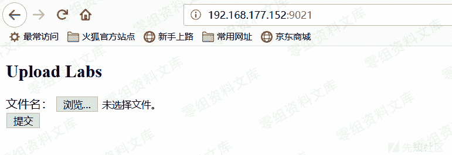
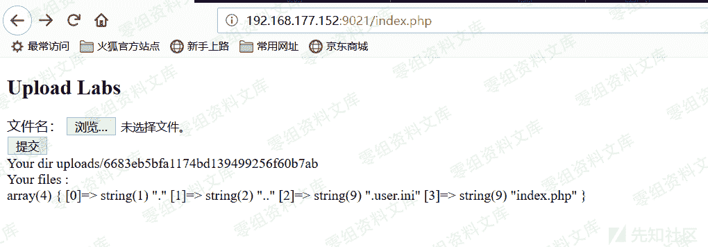

# user.ini 的利用

> 原文：[http://book.iwonder.run/安全技术/上传绕过/1.html](http://book.iwonder.run/安全技术/上传绕过/1.html)

## 前言

在前段时间 SUCTF 2019 的比赛中做了一道名为 CheckIn 的文件上传题，学到了一种新的利用姿势——.user.ini。

原题的链接已经失效了，但 SU 的师傅们把题目源码贴在 GitHub 上了（感谢师傅们！！），如果想尝试的话可以下载源码复现，在这里放一下地址：

[https://github.com/team-su/SUCTF-2019](https://github.com/team-su/SUCTF-2019)

## CheckIn 题目分析

首先我们来看一下题目，首页就是一个简单的上传界面：



我们先上传一个 php 文件试一下，显然是 illegal 的


经过 fuzz 发现修改 content-type 和利用特殊扩展名 php5、pht 等都没有成功（当然也不会这么简单 233）

然后我们把扩展名改为 aaa 试一下会怎样，发现回显：<? in contents!，那么就是说文件内容不能包含<?喽，但我们此时知道它是黑名单过滤了。


我们再把文件内容换一下，发现回显：exif_imagetype:not image!，猜测后端应该调用了 php 的 exif_imagetype()函数，这个很好绕过，添加图片文件头就可以了


我们添加最简单的 gif 文件头 GIF89a，发现上传成功（注意看该文件夹下还有一个 index.php，当时没有注意，但在后面有大用处）


我们先来捋一下思路：

```
-> 上传过滤为黑名单，但 php 脚本文件应该是无法上传的

-> 存在文件头过滤，需要添加图片文件的文件头

-> 文件的内容不能包含<?，但可以上传<script language='php'><scirpt>类型的图片马来绕过 
```

既然是黑名单过滤而且可以上传图片马，那我们首先想到的肯定是传一个.htaccess 上去来将图片马解析为 php，而这种方法经过尝试发现失败了。。。

看了一下服务器是 nginx 1.10.3，似乎版本较高，不存在解析漏洞。

随后在网上看到了一篇 p 牛的文章，讲的是利用.user.ini 来上传 php 后门

## .user.ini

我们先在 php 手册上看一下对.user.ini 的介绍：


大致意思就是：我们指定一个文件（如 a.jpg），那么该文件就会被包含在要执行的 php 文件中（如 index.php），类似于在 index.php 中插入一句：require(./a.jpg);

这两个设置的区别只是在于 auto_prepend_file 是在文件前插入；auto_append_file 在文件最后插入（当文件调用的有 exit()时该设置无效）

## 寻找突破 getflag

看过.user.ini 的分析后我们的思路应该比较清晰了，我们可以上传一个这样的.user.ini：

```
GIF89a
auto_prepend_file=a.jpg 
```



此时我们注意到上传目录下还有一个 index.php，我们正好需要该目录下有一个可执行 php 文件，那这简直暴露了考点就是.user.ini，看来这个思路应该是可行的

然后再上传一个这样的图片马 a.jpg：

```
GIF89a
<script language='php'>system('cat /flag');</script> 
```


最后，我们访问[http://192.168.177.152:9021/uploads/6683eb5bfa1174bd139499256f60b7ab/index.php](http://192.168.177.152:9021/uploads/6683eb5bfa1174bd139499256f60b7ab/index.php)

即可得到 flag

## .user.ini 实战利用的可能性

综上所述.user.ini 的利用条件如下：

服务器脚本语言为 PHP 服务器使用 CGI／FastCGI 模式 上传目录下要有可执行的 php 文件 从这来看.user.ini 要比.htaccess 的应用范围要广一些，毕竟.htaccess 只能用于 Apache

但仔细推敲我们就会感到“上传目录下要有可执行的 php 文件”这个要求在文件上传中也比较苛刻，应该没有天才开发者会把上传文件放在主目录或者把 php 文件放在上传文件夹。

但也不是全无办法，如果我们根据实际情况配合其他漏洞使用可能会有奇效，前段时间我遇到一个 CMS 对上传时的路径没有检测../，因此导致文件可被上传至任意目录，这种情况下我们就很有可能可以利用.user.ini

除此之外，把.user.ini 利用在隐藏后门上应该是个很好的利用方法，我们在存在 php 文件的目录下留下.user.ini 和我们的图片马，这样就达到了隐藏后门的目的。

