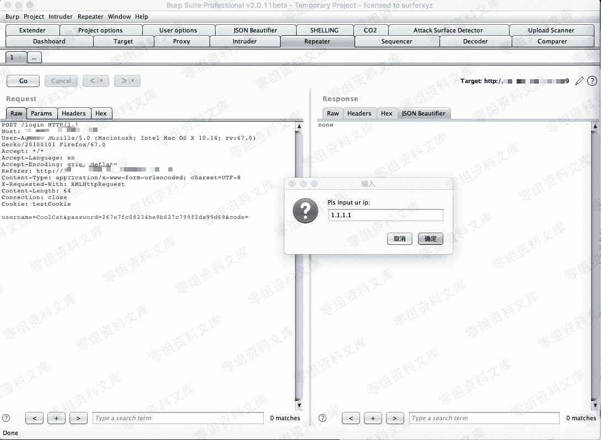
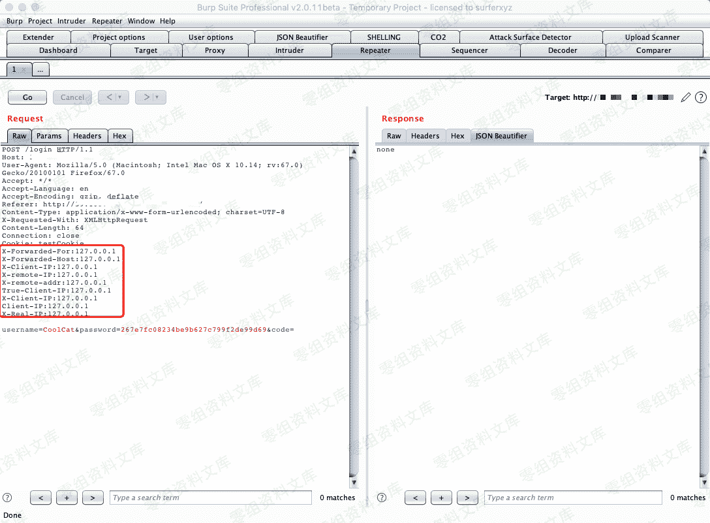
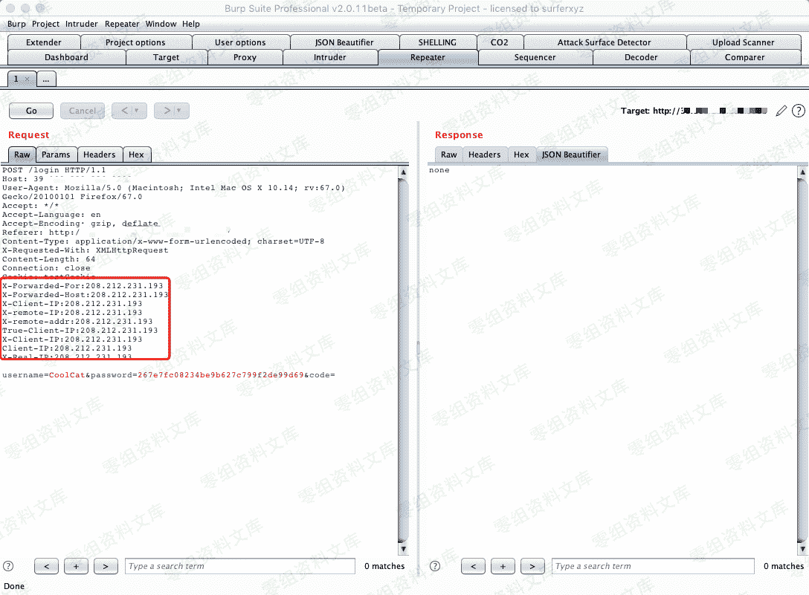
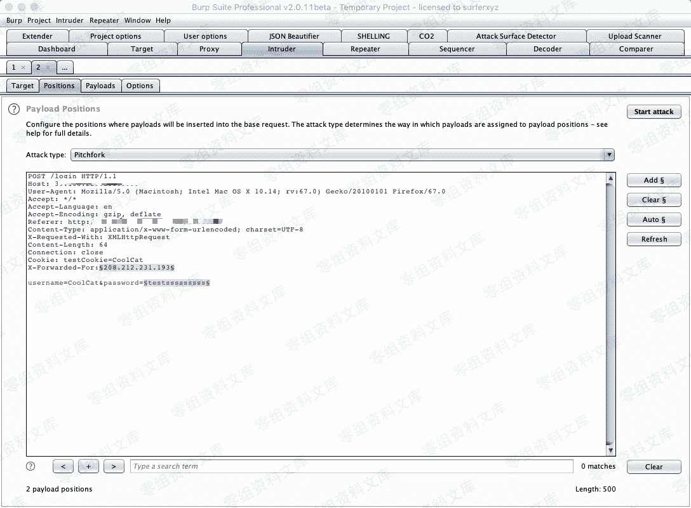
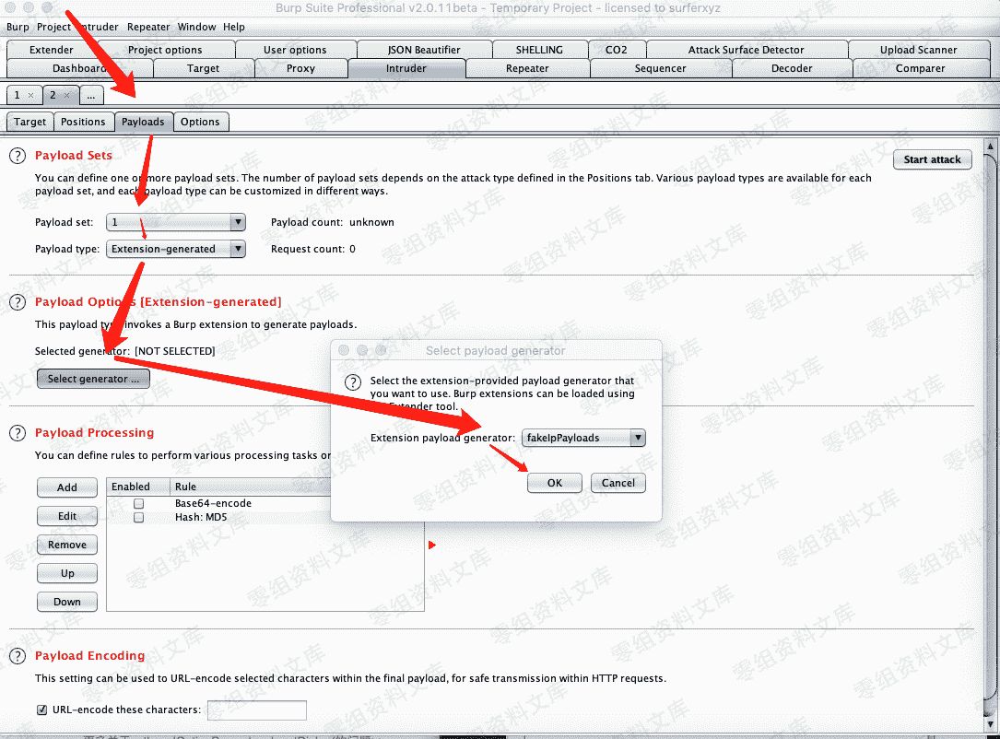

# Burpsuit 伪造 ip 爆破脚本

> 原文：[http://book.iwonder.run/Tools/Burpsuite/1.html](http://book.iwonder.run/Tools/Burpsuite/1.html)

[https://github.com/ianxtianxt/burpsuiefakeip](https://github.com/ianxtianxt/burpsuiefakeip)

## BurpFakeIP


四个小功能

```
伪造指定 ip
伪造本地 ip
伪造随机 ip
随机 ip 爆破 
```

### 0x01 伪造指定 ip

在 Repeater 模块右键选择 fakeIp 菜单,然后点击 inputIP 功能,然后输入指定的 ip




程序会自动添加所有可伪造得字段到请求头中。

### 0x02 伪造本地 ip

在 Repeater 模块右键选择 fakeIp 菜单,然后点击 127.0.0.1 功能：



### 0x03 伪造随机 ip

在 Repeater 模块右键选择 fakeIp 菜单,然后点击 randomIP 功能：



### 0x04 随机 ip 爆破

伪造随机 ip 爆破是本插件最核心的功能。

将数据包发送到 Intruder 模块,在 Positions 中切换 Attack type 为 Pitchfork 模式,选择好有效的伪造字段,以及需要爆破的字段:



按照箭头顺序将 Payload 来源设置为 Extensin-generated,并设置负载伪 fakeIpPayloads,然后设置第二个变量。




点击 Start attack 开始爆破.


如上图,实现每次爆破都使用不同的伪 ip 进行,避免被 ban。

> PS：伪造随机 ip 爆破的先决条件可以伪造 ip 绕过服务器限制。

