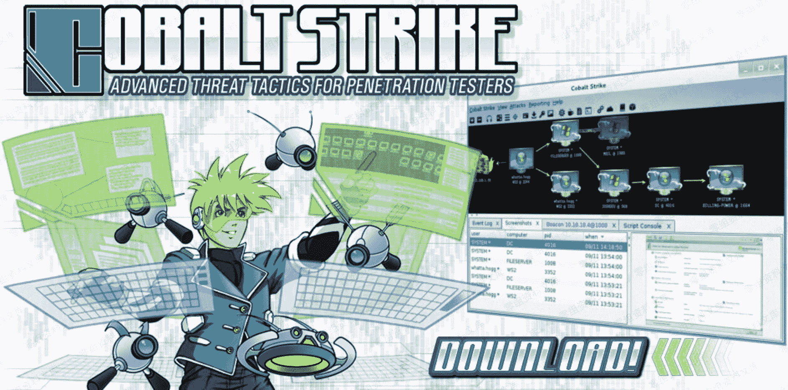

# Cobalt Strike 安装说明

> 原文：[http://book.iwonder.run/Tools/Cobalt Strike/1.html](http://book.iwonder.run/Tools/Cobalt Strike/1.html)



## 安装

Cobalt Strike 分为客户端和服务端，可分布式操作、协同作战。服务器端只能运行在 Linux 系统中，可搭建在 VPS 上。

### 服务端

服务端关键的文件是 teamserver 以及 cobaltstrike.jar，将这两个文件放到服务器上同一个目录，然后运行：

> 安装 java 环境

```
sudo apt install default-jre 
```

> 赋权

```
chmod +x teamserver 
```

> 安装 screen

```
apt-get install screen 
```

> 输入

```
screen 
```

> 在新窗口执行我们需要执行的命令

```
./teamserver ip pass 
```

```
按下组合键 Ctrl a d 关闭窗口并后台执行
screen -ls         查看后台会话
screen -ls         重新进入会话窗口 
```

## 客户端

客户端在 Windows、Linux、Mac 下都可以运行 (需要配置好 Java 环境)。启动 Cobalt Strike 客户端，输入服务端的 IP 以及端口、连接密码，用户名可以任意设置。


在控制台所有操作指令都会被记录保留在 Cobalt Strike 目录 logs 下。

