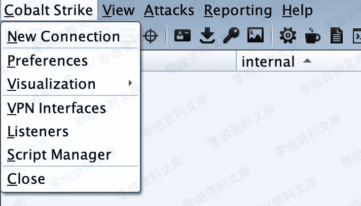
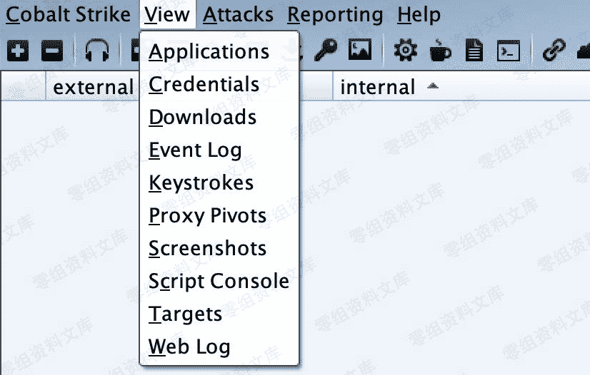
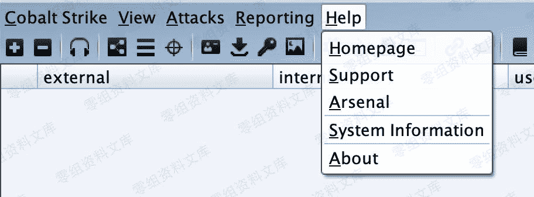
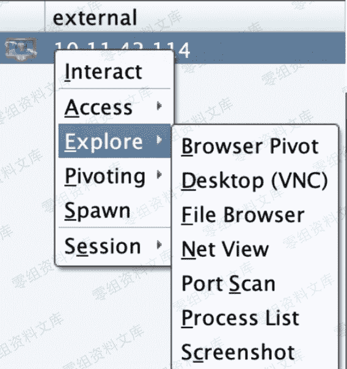
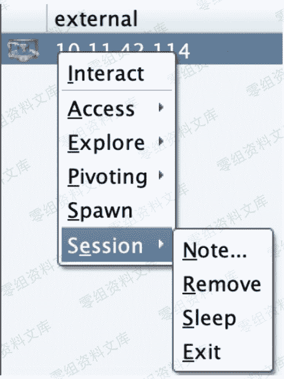

# Cobalt Strike 参数翻译

> 原文：[http://book.iwonder.run/Tools/Cobalt Strike/2.html](http://book.iwonder.run/Tools/Cobalt Strike/2.html)

## 主界面参数

### Cobalt Strike



```
New Connection #新的连接(支持连接多个服务器端)

Preferences #偏好设置(设置 Cobal Strike 界面、控制台、以及输出报告样式、TeamServer 连接记录等)

Visualization #窗口视图模式(展示输出结果的形式)

VPN Interfaces #VPN 接入

Listenrs #监听器(创建 Listener)

Script Manager #脚本管理

Close #关闭 
```

### View



```
Applications #应用(显示受害者机器的应用信息)

Credentials #凭证(通过 hashdump 或 Mimikatz 抓取过的密码都会储存在这里)

Downloads #下载文件

Event Log #事件日志(主机上线记录以及团队协作聊天记录)

Keystrokes #键盘记录

Proxy Pivots #代理模块

Screenshots #截图

Script Console #脚本控制台(可以加载各种脚本，增强功能 https://github.com/rsmudge/cortana-scripts)

Targets #显示目标主机

Web Log #Web 日志 
```

### Attacks

#### Packages


```
HTML Application #生成恶意的 HTA 木马文件

MS Office Macro #生成 office 宏病毒文件

Payload Generator #生成各种语言版本的 payload

USB/CD AutoPlay #生成利用自动播放运行的木马文件

Windows Dropper #捆绑器，能够对文档类进行捆绑

Windows Executable #生成可执行 Payload

Windows Executable(S) #把包含 payload,Stageless 生成可执行文件(包含多数功能) 
```

#### Web Drive-by


```
Manage #对开启的 web 服务进行管理

Clone Site #克隆网站(可记录受害者提交的数据)

Host File #提供 Web 以供下载某文件

Scripted Web Delivery #提供 Web 服务，便于下载和执行 PowerShell Payload，类似于 Metasploit 的 web_delivery 

Signed Applet Attack #启动一个 Web 服务以提供自签名 Java Applet 的运行环境

Smart Applet Attack #自动检测 Java 版本并利用已知的 exploits 绕过 security

System Profiler #用来获取一些系统信息，比如系统版本，Flash 版本，浏览器版本等 
```

### Reporting


```
0\. Activity report #活动报告

1\. Hosts report #主机报告

2\. Indicators of Compromise #威胁报告

3\. Sessions report #会话报告

4\. Social engineering report #社会工程学报告

5\. Tactics, Techniques, and Procedures #策略、技巧和程序  

Reset Data #重置数据

Export Data #导出数据 
```

### Help



```
Homepage #官方主页

Support #技术支持

Arsenal #开发者

System information #版本信息

About #关于 
```

## 右键菜单参数

### Access


```
Dump Hashes #获取 hash

Elevate #提权

Golden Ticket #生成黄金票据注入当前会话

Make token #凭证转换

Run Mimikatz #运行 Mimikatz 

Spawn As #用其他用户生成 Cobalt Strike 侦听器 
```

### Explore



```
Browser Pivot #劫持目标浏览器进程

Desktop(VNC) #桌面交互

File Browser #文件浏览器

Net View #命令 Net View

Port Scan #端口扫描

Process List #进程列表

Screenshot #截图 
```

### Pivoting


```
SOCKS Server #代理服务

Listener #反向端口转发

Deploy VPN #部署 VPN 
```

### Spawn

外部监听器(如指派给 MSF，获取 meterpreter 权限)

### Session



```
Note #备注

Remove #删除

Sleep #指定被控端休眠时间，默认 60 秒一次回传，让被控端每 10 秒来下载一次任务。实际中频率不宜过快,容易被发现。

Exit #退出 
```

