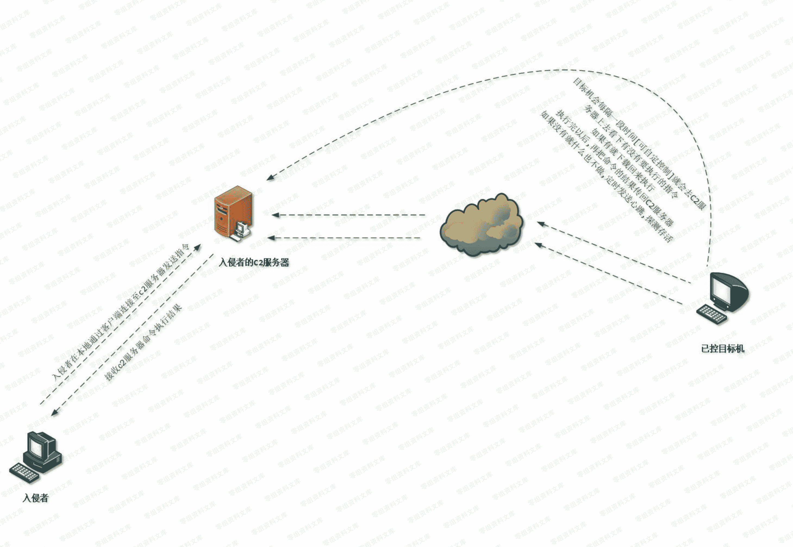

> 原文：[http://book.iwonder.run/Tools/Cobalt Strike/14.html](http://book.iwonder.run/Tools/Cobalt Strike/14.html)

## Cobalt Strike C2 Profile 简介

### 什么是 C2

> 通俗称谓, 即 所谓的 命令[command] 和 控制[control]服务器 [C&C 服务器],简称 C2 ,其大致工作原理如下,首先,需要先在本地用对应的 C2 客户端连接到我们的 C2 服务器上,之后,当目标机器一旦正常执行了我们的负载[即 payload],它[负载]便会根据预我们先设置好的延迟,在规定的时间之后回连至 C2 服务器,而我们此时在本地 C2 客户端上看到的直观效果,就是目标机器上线,至于如何去远程操作目标机器就非常简单了,假设我们的负载是 6 秒回连一次,现在我在本地的 C2 客户端执行了一个 whoami 的指令,这中间从接收命令到执行命令再到回显结果的过程具体又是怎样的呢 ? 其实也比较简单,当我们在本地 C2 客户端执行了一个 whoami 的指令之后,指令首先会被 C2 客户端发送到 C2 服务器上,当目标机器上的负载下一次回连至 C2 服务器上时,一看原来要执行一个 whoami 命令,负载便会把要执行的命令下载到目标机器上进行执行,随后则会再把执行后的结果回传给 C2 服务器,c2 服务器再把结果传至 C2 客户端,回显到我们的眼前,这便是 C2 最基本的工作原理,为什么一定要说这个呢,因为它对于我们后面去深入理解 CobaltStrike 的工作原理至关重要,可以说也是完全类似的工作模型

