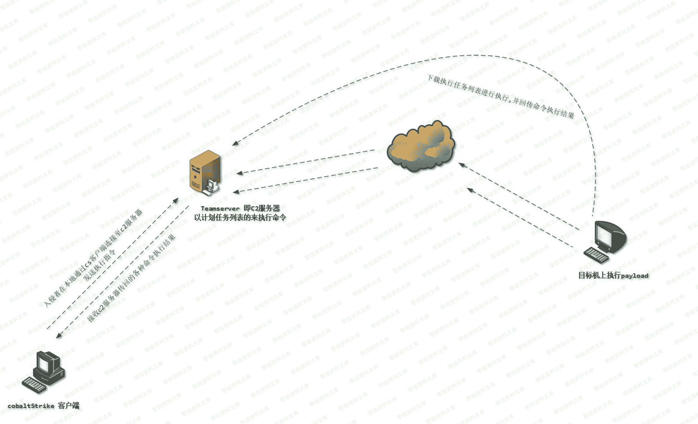

> 原文：[http://book.iwonder.run/Tools/Cobalt Strike/15.html](http://book.iwonder.run/Tools/Cobalt Strike/15.html)

## Cobalt Strike C2 Profile 原理

### 关于 CobaltStrike 团队服务器工作原理

> 从上面我们大概了解了下 C2 的基础工作原理,接着,就再来简单看下 CobaltStrike 的工作细节,其实,说白点,上面的通信模型就是 CobaltStrike 的工作原理,只不过,叫法不同,更加细节具体了而已,如下图所示,cobaltstrike 团队服务器会将要执行的任何动作都以计划任务列表的形式进行管理,也就是说,通过 cobaltstrike 客户端发送到团队服务器的任何动作都会被弄成计划任务的形式依次排队[ 这也就是 beacon 内置的那个 job 命令存在的实际意义,后续还会再说明这个东西 ],而后等着目标机器上的负载[payload]来下载这些计划任务列表中的具体指令去目标机器上执行,随后再依次把执行完的结果回传给 cobaltstrike 团队服务器,团队服务器再回显至 CobaltStrike 客户端,大概流程其实就这么简单,自己已是竭尽所能的将这个东西简化的不能再简化了,目的就是为了便于弟兄们能彻底理解,当你真正理解了这些最基础的常识之后,后续对 CobaltStrike 的某些功能的具体实现细节理解的肯定也会更深,实战应用上自然就更加得心应手,ok,废话不多说,我们继续往下看

