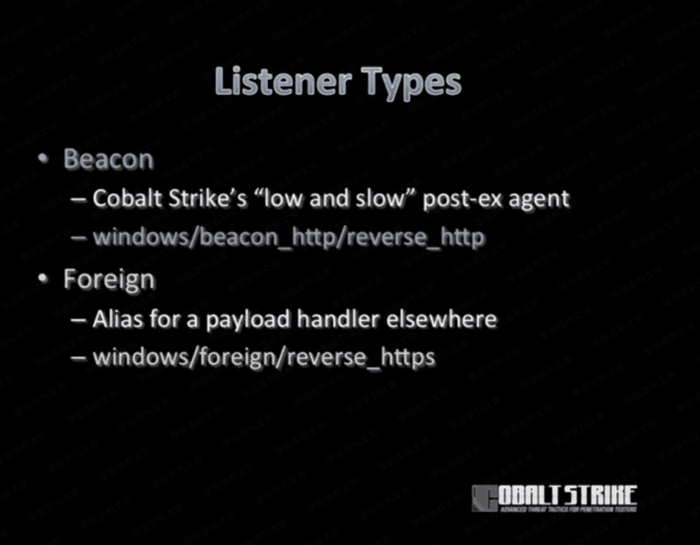

# Cobalt Strike 生成监听器

> 原文：[http://book.iwonder.run/Tools/Cobalt Strike/4.html](http://book.iwonder.run/Tools/Cobalt Strike/4.html)

## Listeners 简介

在本版本 Cobalt Strike 3.14 中，提供了如图 9 种 Listener (监听器)。


```
windows/beacon_dns/reverse_dns_txt

windows/beacon_dns/reverse_http

windows/beacon_http/reverse_http

windows/beacon_https/reverse_https

windows/beacon_smb/bind_pipe

windows/beacon_tcp/bind_tcp

windows/foreign/reverse_http

windows/foreign/reverse_https

windows/foreign/reverse_tcp (3.13 版后增加，支持 linuxSSH 会话) 
```



*   beacon_xx 系列为 Cobalt Strike 自身，包括 dns、http、https、smb 四种方式的监听器。
*   foreign 系列为外部监听器，通常与 MSF 或者 Armitage 联动。

在 Cobalt Strike 3.13 版本后增加了一个新的 Listeners (windows/beacon_tcp/bind_tcp) ，它支持 linuxSSH 会话。具体更新内容可以查阅

