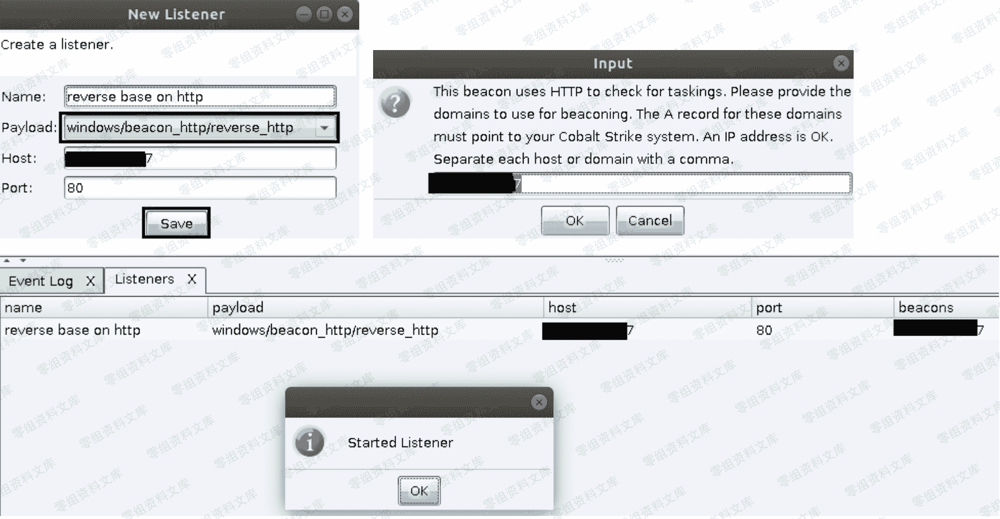
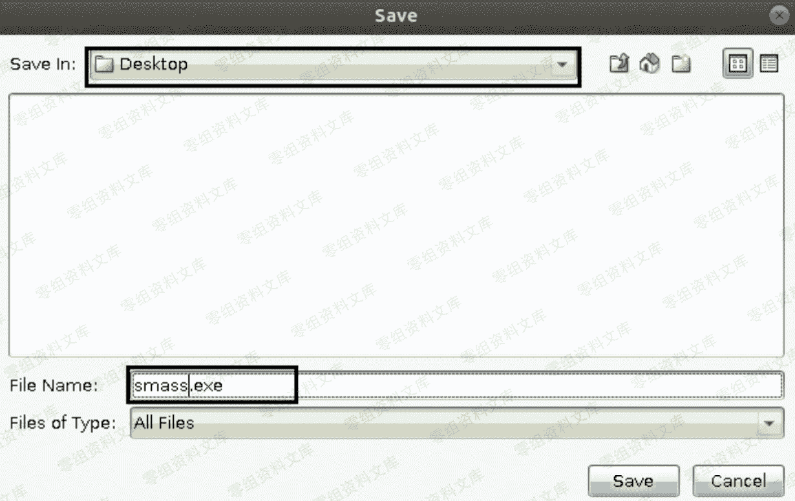
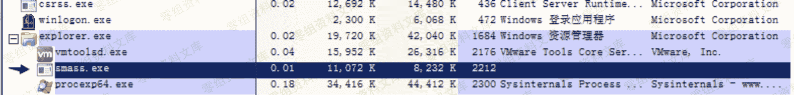
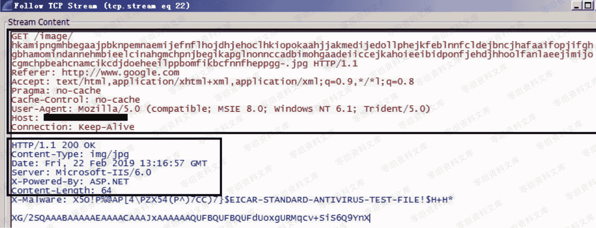

> 原文：[http://book.iwonder.run/Tools/Cobalt Strike/9.html](http://book.iwonder.run/Tools/Cobalt Strike/9.html)

## windows/beacon_http/reverse_http [ 基于 http 协议的反向连接 ]

> 特别说明下,大家大可不必觉得,一听到什么协议就感觉很高精尖一样,其实并不然,所谓基于 http,说通俗点,无非就是把木马回连的流量,严格按照 http 协议的数据格式进行正常封装收发[ 数据交换 ],专业点叫 模拟 http 协议 进行传输,之所以要用 http 协议,无非就是因为它对防火墙的穿透效果相对于其它协议稍好一点
> 
> 此外,由于我们所使用的是 CobaltStrike 的试用版,所以监听器的创建个数是有限制的,默认同时只能创建一个,不过后期可自行反编译代码,破除这种限制,此处暂时先不多说,来看下具体使用,其实非常简单,直接选中该协议监听器,指定 ip[ 即 vps ip ]端口和监听器名称,点击"save"

> 紧接着,再利用上面监听器生成 payload,注意,此处是直接生成 64 位的 exe payload,实战中的具体位数要根据目标系统的实际位数来确定,当然啦,实战中也不可能就直接这样生成着去用,因为这种方式生成的 payload 很显然是不可能免杀的,不过此处仅作为入门学习,暂时大可不必管那么多

> 之后,将上面生成好的 exe payload 丢到目标机器上去执行,稍等片刻便能看到 beacon shell 被正常弹回,正如我们预期的那样,payload 10 秒发一次心跳数据

> 要特别注意下的是,CobaltStrike 的 exe payload 默认执行以后在目标系统中就一个进程,一旦对方手动把这个进程给 kill 掉,你的 beacon shell 也就掉了

> 最后,我们再用 wireshark 来简单看下 reverse_http 监听器的数据收发过程,正如我刚才在上面所说,它就是按照 http 的数据格式来进行数据交换的,当然,此处我们用的仍然是自定义 profile,关于收发过程,其实在之前的文章中也已经看过了,这儿就不多说了,还不了解 http 协议的弟兄,可自行再单独去好好补充下这方面的知识

