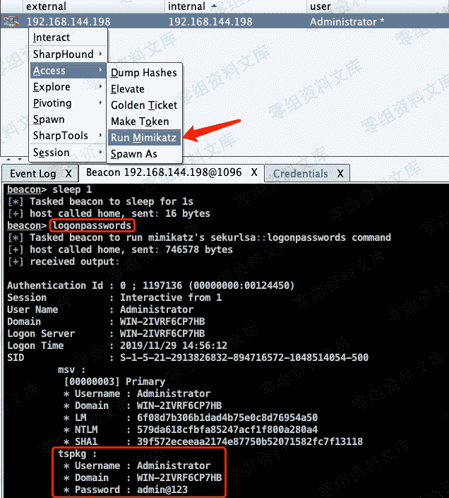
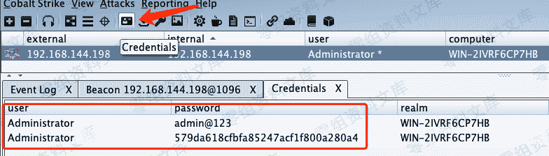

# Cobalt Strike 获取凭据

> 原文：[http://book.iwonder.run/Tools/Cobalt Strike/5.html](http://book.iwonder.run/Tools/Cobalt Strike/5.html)

目标机器 CobalStrike 上线后，通常先抓取该主机凭据。

选择执行 Access–>Run Mimikatz ，或在 Beacon 中执行 logonpasswords 命令。需要当前会话为管理员权限，才能成功，如果权限低，请先提权~

点击工具栏的 Credentials，可以看到获取的凭据信息。（Credentials 可自行添加）

> 不是每次都能成功获取到明文密码的，要看内存中是否存储。

