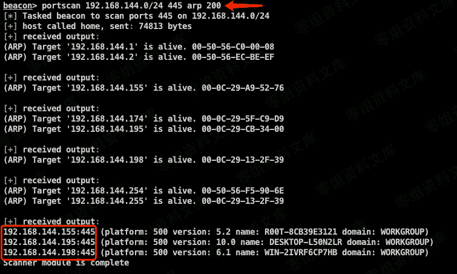
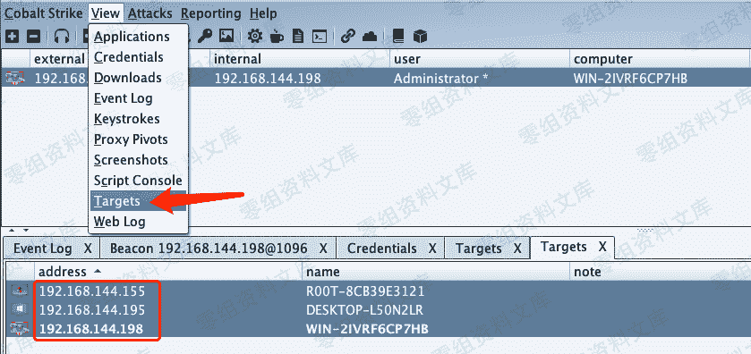
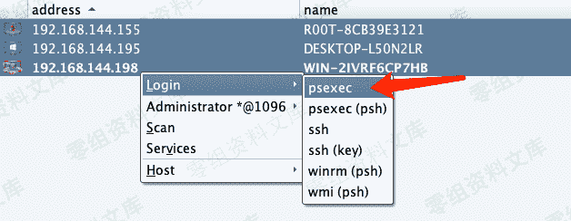
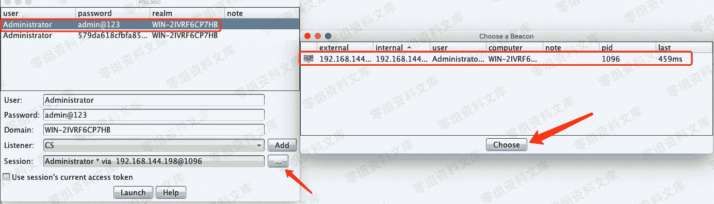

# Cobalt Strike psexec 传递

> 原文：[http://book.iwonder.run/Tools/Cobalt Strike/6.html](http://book.iwonder.run/Tools/Cobalt Strike/6.html)

获取凭据后，需要对目标网段进行端口存活探测，缩小范围。探测方式比较多，本文仅依托 CobalStrike 本身完成，不借助其他工具。因为是 psexec 传递登录，这里仅需探测 445 端口。（ psexec：在主机上使用服务派生会话 ）

## 使用 portscan 命令：

> ip 网段 — ports 端口 — 扫描协议（arp、icmp、none）— 线程（实战不要过高）。

```
beacon> portscan 192.168.144.0/24 445 arp 200 
```



> 点击工具栏的 View–>Targets，查看端口探测后的存活主机。（Targets 可自行添加）



> 选择 Login–>psexec 传递登录。



> 选择之前获取到的凭据信息（明文密文均可），此处选择明文，并确定接收的 Listener 与主机的 Session。



> 在 Beacon 中可以看到执行的命令，并会显示成功登录的 ip，之后就便会上线 CobalStrike。这样就控制了多个主机的系统权限。


> 附：psexec 密文传递 Beacon 中执行的命令。【不是 psexec(psh)选项】


